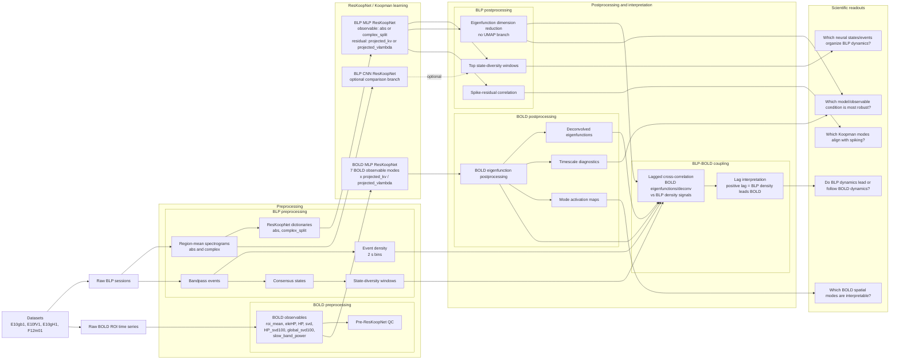
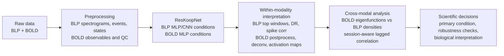

# Analysis Framework Pipeline Overview

This note is a meeting-ready draft of the full analysis framework. The goal is
to show how the BLP and BOLD analyses fit into one ResKoopNet / Koopman
dynamics workflow, and to separate the scientific questions from the many
implementation conditions.

## One-Slide Pipeline Diagram

## Compact Version For A Slide

Use this if the full diagram is too dense for one slide.

## Condition Design To Explain

The conditions should be framed as controlled perturbations of the modeling
choice, not as a brute-force list.

| Axis | Conditions | Interpretation |
|---|---|---|
| Model family | MLP, CNN | MLP is the primary vector-observable model. CNN is an optional branch to test whether local spectrogram structure helps. |
| BLP observable | abs, complex_split | abs focuses on power magnitude. complex_split keeps real and imaginary spectrogram information. |
| Residual form | projected_kv, projected_vlambda | Two residual definitions for Koopman-consistent reconstruction and dynamics. |
| BOLD observable | roi_mean, eleHP, HP, svd, HP_svd100, global_svd100, slow_band_power | Tests spatial scale, targeted regions, and dimensionality reduction choices. |
| Postprocessing target | state diversity, eigenfunction DR, spike correlation, BOLD activation, BLP-BOLD correlation | Tests whether learned dynamics map onto state structure, spiking, spatial BOLD maps, and cross-modal lagged coupling. |

## Suggested Figure Set For The Discussion

Keep the meeting centered on the framework. Show representative figures rather
than every condition.

| Figure | Purpose |
|---|---|
| Pipeline overview | Establish the full analysis framework. |
| Condition matrix | Explain why each condition exists and which are primary vs robustness branches. |
| BLP top state-diversity window | Show how Koopman dynamics align with interpretable BLP state structure. |
| Eigenfunction DR/state-space plot | Show whether states separate in learned coordinates. |
| Spike-residual correlation heatmap or top-bar plot | Show whether residual dynamics relate to spiking. |
| BOLD activation map | Show whether BOLD Koopman modes have spatial interpretation. |
| BLP-BOLD lagged cross-correlation plot | Show directionality and timing of cross-modal coupling. |

## Proposed Meeting Questions

- Which BLP condition should be the primary analysis: abs or complex_split?
- Which residual form should be primary: projected_kv or projected_vlambda?
- Should CNN remain a supplemental comparison branch?
- Which BOLD observable modes are biologically most meaningful?
- Should BLP-BOLD coupling use event density, state diversity, eigenfunction density, or all as robustness checks?
- How should we define and report lag direction in the BLP-BOLD correlation analysis?
