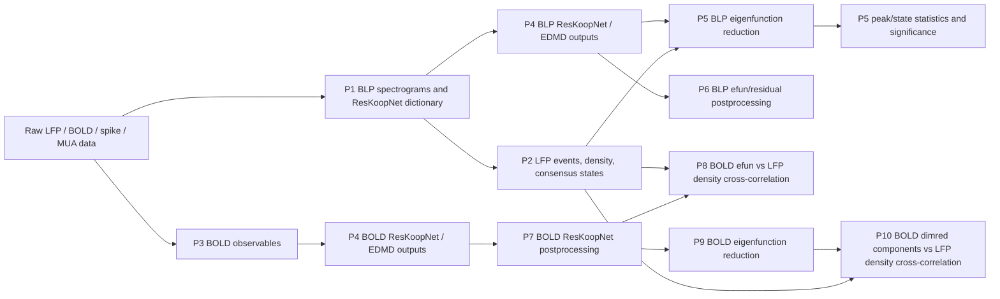

# Project Mainline Pipeline Reference

Updated: 2026-05-23

## 中文速读

这份文档的核心结论是：P5 主线不是 `summary_figures`，也不是任何平铺出来的 PNG 文件夹，而是每个数据集下面的 canonical MAT：

```text
E:\DataPons_processed\<dataset>\pipeline5_eigenfunction_reduction\<condition_tag>\<method_tag>\mat\*_efun__*.mat
```

`pipeline5_summary_figures`、`summary_figures`、peak statistic、cross-dataset consistency、trajectory figures 都是从这些主线结果派生出来的浏览层或统计层。它们有用，但必须带着 source MAT provenance 看。

当前你要的 `consensus state trajectory in dimred efun space` 已经改成默认 **scatter 版本**。旧的 line/surface renderer 只作为 legacy option 保留；已经平铺出来的历史 trajectory 文件夹仍然可能是混合状态，不能当最终结论。

历史版本不要删。历史里可能有有用的 event-vs-baseline significance 结果，主要看：

```text
E:\DataPons_processed\<dataset>\pipeline5_eigenfunction_peaks_by_state\
E:\DataPons_processed\<dataset>\pipeline5_eigenfunction_peaks_by_state_maxabs\
```

This document is meant to stop the version confusion. It separates:

- **Canonical mainline outputs**: the files that should be treated as source of truth for a pipeline stage.
- **Derived outputs**: figures, summaries, peak statistics, cross-dataset reports, and convenience copies generated from canonical outputs.
- **Historical outputs**: older runs that may still contain useful evidence, but must not be silently mixed with current mainline results.

The most important immediate rule is:

> For Pipeline 5, the canonical output is the MAT result under `pipeline5_eigenfunction_reduction`, not any copied figure folder. Scatter trajectory figures are the current desired QC visualization. Existing line/surface trajectory figures should be treated as historical or inconsistent derived figures unless regenerated intentionally.

## Global Paths

The processed root is resolved by `functions/io/+io_project/get_project_processed_root.m`.

Priority:

1. Environment variable `LFP_BOLD_KPM_PROCESSED_ROOT`
2. Windows default: `E:\DataPons_processed\`
3. POSIX/WSL default: `/mnt/e/DataPons_processed/`

Dataset root:

```text
E:\DataPons_processed\<dataset_stem>\
```

Common dataset stems in the current work:

```text
e10gb1
e10fV1
e10gh1
f12m01
e10gw1
```

This five-dataset set matches the `backfill_datasets` default in `scripts/script_backfill_current5_minimal_pipeline_set.m`.

AutoDL / ResKoopNet P4 roots should be recorded by modality. Do not treat these as one interchangeable folder.

Current BLP ResKoopNet / MLP outputs used by P5 and P6:

```text
E:\autodl_results_new\<dataset>\mlp\outputs\
```

Legacy BLP root, for historical inspection only:

```text
E:\autodl_results\<dataset>\mlp\outputs\
```

Current BOLD ResKoopNet / MLP outputs used by P7 and downstream P8/P9/P10:

```text
E:\autodl_results_local\bold_wsl\<dataset>\mlp\outputs\
```

Legacy/fallback BOLD search root:

```text
E:\autodl_results\bold\<dataset>\mlp\outputs\
```

Current checked meaning:

- The current five datasets have BOLD P4 outputs under `E:\autodl_results_local\bold_wsl\<dataset>\mlp\outputs\`.
- `E:\autodl_results\bold\<dataset>\mlp\outputs\` was empty or missing for the current five datasets at the 2026-05-16 filesystem check.
- Therefore, use `E:\autodl_results_local\bold_wsl` as the current BOLD P4 source unless a later audit explicitly says otherwise.

Code behavior:

- `functions/postprocessing/build_bold_reskoopnet_postprocessing_params.m` sets both paths in `params.autodl_roots`.
- `functions/postprocessing/discover_completed_bold_reskoopnet_runs.m` scans both roots.
- If `dedupe_by_condition = true`, it keeps the latest run for each `dataset_stem | observable_mode | residual_form` condition, based on `last_write_time`.
- The current BOLD source for a specific P7/P8/P9/P10 artifact should still be recorded from run metadata, especially `run_info.autodl_root` / `result.source` / `BOLD_POST` provenance.

Current policy:

- Treat `E:\autodl_results_local\bold_wsl` as the current BOLD P4 source.
- Treat `E:\autodl_results\bold` as legacy/fallback unless a later audit finds current runs there.
- In audit tables, record the exact BOLD source root for every artifact.
- If the same condition exists in both roots, mark the selected one by timestamp and keep the other as historical/alternate.

Important distinction:

- BLP scripts usually take one `autodl_root`.
- BOLD scripts usually take a list `autodl_roots`.
- Current BLP audits should expect `E:\autodl_results_new\<dataset>\mlp\outputs\`.
- If a current-looking P5/P6 result points to `E:\autodl_results\<dataset>\mlp\outputs\`, mark it as legacy/stale unless there is an explicit exception.
- A current audit table should still store the exact source root for each result, because `E:\autodl_results\` can mean old BLP runs while `E:\autodl_results\bold\` means BOLD runs.

Global summary/cache root:

```text
E:\DataPons_processed\summary_figures\
```

Important warning: `summary_figures` and per-dataset summary figure folders are convenience products. They are not canonical source data.

## Current Checked Locations

Filesystem check on 2026-05-16:

Current BLP P4 source root:

```text
E:\autodl_results_new\<dataset>\mlp\outputs\
```

Observed status:

```text
e10gb1: present
e10fV1: present
e10gh1: present
f12m01: present
e10gw1: no BLP P4 output files found here
```

Current BOLD P4 source root actually containing data:

```text
E:\autodl_results_local\bold_wsl\<dataset>\mlp\outputs\
```

Observed status:

```text
e10gb1: present
e10fV1: present
e10gh1: present
f12m01: present
e10gw1: present
```

The alternative BOLD root:

```text
E:\autodl_results\bold\<dataset>\mlp\outputs\
```

was empty or missing for the current five datasets at this check. Treat it as a search/legacy fallback unless a later audit finds current runs there.

Current processed pipeline outputs are saved under:

```text
E:\DataPons_processed\<dataset>\
```

Important current processed subfolders:

```text
pipeline5_eigenfunction_reduction
pipeline5_eigenfunction_peaks_by_state_maxabs
pipeline6_top_state_diversity_postprocessing
pipeline7_bold_reskoopnet_postprocessing
pipeline8_xcorr
pipeline9_bold_eigenfunction_reduction
pipeline10_dimred_xcorr
```

Observed processed-stage gaps at this check:

```text
P9: current result PNGs are inside pipeline9_bold_eigenfunction_reduction, not inside the separate pipeline9_figures_bold_eigenfunction_reduction stage.
P10: only e10fV1 currently has pipeline10_dimred_xcorr and pipeline10_dimred_top_maps outputs.
P10 missing: e10gb1, e10gh1, e10gw1, f12m01.
e10fV1 P10 caveat: 96 pv_gsvd100_ds runs are present, plus 5 partial pv_gsvd100 deconv_abs/MDS runs that should be treated as legacy/partial unless explicitly selected.
P10 manifest caveat: only empty historical manifests were found under E:\DataPons_processed\postprocessing_manifests\pipeline10_dimred_xcorr\ at this check, so P11 should derive P10 completeness from canonical run folders and per-run files.
```

Remaining P1-P10 location/layout issues found in this audit:

```text
P1: no location mismatch found; current processed folders match the stage resolver.
P2: canonical top-window figure folders exist where available; event-diversity outputs remain minor and should stay out of default completeness.
P3: pipeline3_figures_bold_pre_reskoopnet_qc_summary exists as a stage key but no current dataset-local outputs were found there.
P4: no processed stage by design; current BLP/BOLD roots still need legacy fallback removal in code.
P5: current maxabs peak-state output uses pipeline5_eigenfunction_peaks_by_state_maxabs, but this folder is not in get_pipeline_stage_name.m.
P5: pipeline5_summary_figures is a cache, not a resolver-backed canonical stage.
P6: lagged SPKT stages are resolver-backed but currently absent for all datasets; keep optional/non-mainline.
P6: E:\DataPons_processed\window_figures is a copied cache and should not drive completeness.
P7: summary stage names resolve via summary_figures, not dataset-local stage folders; current dataset-local P7 figure-summary folders are absent.
P8: e10gb1 still contains old/noncanonical folders pipeline8_bold_efun_density_cross_correlation, pipeline8_figures_bold_top_xcorr_activation_maps, and pipeline8_flat_top_xcorr_figures.
P8: global summary_figures copies exist and are historical/cache; they should not drive completeness.
P9: dedicated figure stage exists in the resolver but current figures are still co-located with result MATs.
P10: dedicated summary stages exist in the resolver but are absent; P11 must build flat summaries directly from canonical run folders.
```

## Modification Plan

Status snapshot, 2026-05-22:

- Completed: current invalid/stale BLP P4 run registry and default filtering for P5/P6/P11 discovery.
- Completed: P11 best-checkpoint rule for P7 and downstream P8/P9/P10 provenance.
- Completed: P2 event-diversity/window outputs are minor/nonblocking in default P11 completeness.
- Completed: P8/P10 numeric-first defaults; xcorr MAT/CSV are current completeness, browse figures are optional/backfill.
- Completed: P8 first-stage cross-session consistency implementation with top5 strength, method x k, preference, lag, and compact ranking outputs.
- Completed in code: P5 raw/dimred thresholded density now uses activity
  magnitude by default (`abs`, with explicit activity metadata) and writes raw
  efun index/timescale plus dimred component weighted-timescale provenance.
  P11 marks older P5 density MATs as stale against this new rule.
- Still pending: legacy path cleanup, P6 MUA all-channel rerun, P5
  activity/envelope peak-statistics regeneration, P5 selective-component 3D
  trajectory exporter, P3 QC build-path integration, P9 figure-stage
  normalization, P10/P8 display simplification, and any data backfill required
  by the current P11 audit.

### 1. Remove Legacy Path Dependencies From Code

Current policy:

- Code should not depend on legacy/fallback paths for normal mainline runs.
- Legacy paths can remain in documentation as historical references, but they should not be part of default discovery, default params, or current-run dependency chains.

Current mainline source roots should be:

```text
BLP P4:  E:\autodl_results_new\<dataset>\mlp\outputs\
BOLD P4: E:\autodl_results_local\bold_wsl\<dataset>\mlp\outputs\
```

Legacy paths to remove from code defaults/dependencies:

```text
E:\autodl_results\<dataset>\mlp\outputs\
E:\autodl_results\bold\<dataset>\mlp\outputs\
```

Planned code cleanup:

- Replace BLP default `autodl_root = E:\autodl_results` with `E:\autodl_results_new`.
- Remove `E:\autodl_results\bold` from BOLD default `autodl_roots`.
- Remove fallback/search logic that silently scans legacy roots during current mainline runs.
- Keep any historical inspection scripts explicit: they must opt into legacy paths by variable or argument, not by default.
- Add audit checks that flag any current-looking artifact whose provenance points to a legacy root.

Current-run invalid/stale registry:

Status, 2026-05-22: completed for registry creation and default filtering.
`configs/current_invalid_blp_mlp_runs.csv` exists, BLP P5/P6 discovery calls
`filter_invalid_blp_mlp_runs`, and P11 loads the same registry by default.

- Implemented: `configs/current_invalid_blp_mlp_runs.csv` is the current BLP P4 invalid/stale run registry.
- Implemented: current BLP discovery for P5/P6 and P11 consults this registry by default and excludes rows whose status is `invalid`, `stale`, or `legacy`.
- Current policy remains: do not silently fall back to an older run when the newest/current source is invalid unless a script is explicitly run in historical/forensic mode. For current completeness, the condition should be reported as current-missing or stale until a valid P4 rerun exists.
- Current downgraded run, 2026-05-21:

```text
dataset: e10fV1
condition: complex_split_projected_vlambda
run: E:\autodl_results_new\e10fV1\mlp\outputs\mlp_obs_blp_vlambda_mainline_torchlike_20260509_e10fV1_seed1234_projected_vlambda_complex_split\
status: invalid/stale
reason: P6 top-window QC found selected top-30 eigenfunctions were time-constant in 22/30 top windows; the e10fV1 abs branch was normal.
```

- Until this P4 run is recomputed or explicitly cleared, all downstream P5/P6 products derived from `e10fV1 complex_split_projected_vlambda` should be treated as stale for current mainline browsing and analysis.
- P11 should not copy figures from invalid/stale BLP runs into `pipeline11_current_analysis_summary`.
- Remaining implementation: add a lightweight zero-variance/flat-eigenfunction audit to P11/P6 QC so future corrupted-but-existing P4/P6 products are detected by numeric content, not only by file/folder presence.

### 2. Treat Event-Diversity Window Outputs As Minor

Current policy:

- `pipeline2_event_diversity_windows`
- `pipeline2_figures_event_diversity_top_window_plots`
- event-diversity top-window plots and manifests

are **minor/auxiliary browsing outputs**, not required mainline completeness outputs.

Status, 2026-05-22: completed for P11 completeness behavior. P11 marks these
as `minor_ok` / `minor_missing` and does not create fill-plan actions only
because event-diversity window outputs are absent. This does not mark the
separate P2 folder-migration cleanup in Section 3 as complete.

Planned audit behavior:

- Implemented: ignore event-diversity window outputs when checking dataset completeness.
- Implemented: do not mark a dataset incomplete only because event-diversity windows or their top-window figures are missing.
- Keep event-diversity outputs available for visual browsing when they exist.
- Consensus-state outputs and consensus-state-diversity windows remain more relevant to current state-based downstream checks than raw event-diversity windows.

### 3. Normalize P2 Figure Paths And Remove Old Result Locations

Current problem:

```text
Current exporter default:
E:\DataPons_processed\<dataset>\consensus_state_diversity_windows\top_window_plots\

Canonical P2 figure stage:
E:\DataPons_processed\<dataset>\pipeline2_figures_consensus_state_top_window_plots\
```

Required cleanup:

- Change the P2 consensus-state top-window figure exporter default save path to the canonical `pipeline2_figures_consensus_state_top_window_plots` stage.
- Move existing current results from the old unprefixed folder into the canonical `pipeline2_*` folder.
- Preserve `plot_manifest.csv` and make all paths inside it point to the canonical location.
- After verifying file counts, filenames, image readability, and manifest paths, remove the old unprefixed result folder.
- Mainline scripts and audits must not search both old and new paths. They should use the canonical `pipeline2_*` folder only.

User policy:

```text
No old-version result folders should remain in the current mainline tree.
Historical/legacy outputs should be either migrated into canonical current folders or explicitly removed/quarantined after verification.
```

### 4. Restrict P3 BOLD Observables To Current Selected Modes

Current P3 mainline should not use every BOLD observable mode that the code can build or that exists historically on disk.

Current P3 build/QC set:

```text
global_svd100
gsvd100_ds
HP_svd100
roi_mean
```

Current downstream minimal set for P7/P8/P9/P10:

```text
global_svd100
gsvd100_ds
HP_svd100
roi_mean
```

Other option / historical / robustness-only modes unless explicitly re-enabled:

```text
HP
eleHP
svd
slow_band_power
slow_band_power_svd
global_slow_band_power_svd100
roi_mean_slow_band_power
```

Required cleanup:

- Update P3 builder defaults so normal current runs build only the selected current modes.
- Make `gsvd100_ds` a formal supported P3 observable path if it remains in the current set.
- P3 completeness checks should require only the current P3 build/QC set.
- Downstream BOLD checks should require only the current downstream minimal set.
- Existing non-current observable files should be migrated, quarantined, or removed from the current mainline tree after verification, because they should not look like current required outputs.
- Fix P3 QC script naming: current backfill references `scripts/script_plot_one_cfg_bold_pre_reskoopnet_qc.m`, but the existing script is `scripts/script_plot_bold_pre_reskoopnet_qc.m`.
- Rework P3 QC figure export so the default launcher uses the current five datasets, the four current P3 modes, and the canonical `pipeline3_figures_bold_pre_reskoopnet_qc` folder. Do not keep project-root figure copies or old `bold_observables_qc` copies as mainline outputs.
- Integrate P3 QC into the default observable build path: when `script_build_one_cfg_bold_observables.m` builds or recomputes an observable mode, it should generate the QC summary PNG immediately after saving the observable artifact.
- Avoid redundant data loading for new P3 outputs: pass the in-memory observable/session/snapshot data from the just-built `O` and `snap` structs into `plot_bold_pre_reskoopnet_qc` instead of saving the MAT file and then immediately reloading it. Disk reads are acceptable only when the observable MAT already existed and the QC figure is missing or being regenerated.
- Make P5 derived inspection outputs default-on after P5 reduction: peak-statistics figures, per-dataset method-consistency figures, and cross-dataset consistency figures should be generated automatically from the current P5 MAT/CSV outputs. They remain derived outputs, but they should not require a manual extra step during mainline completion checks.
- Modification needed: P5 peak statistics, selectivity, density sources, and trajectory QC should follow the activity-magnitude policy in `docs/eigenfunction_activity_magnitude_policy_2026-05-22.md`. Mainline activity means `abs`/envelope/RMS magnitude, not unanchored signed polarity.

### 5. Make P5 Trajectory QC Use Selective Components, Not Fixed First Dimensions

Current problem:

- The current `consensus state trajectory in dimred efun space` QC figures can be generated from the first three dimred components/dimensions by default.
- That is not aligned with the current scientific question. The useful dimensions are the ones that are event-family active and selective, not necessarily dimensions 1-3.
- For NMF, MDS, UMAP, and even SVD under different `k`, component order is a reduction/output convention, not proof that the first three dimensions are the biologically relevant ones.

Required cleanup:

- Use `docs/eigenfunction_activity_magnitude_policy_2026-05-22.md` as the design reference for P5 activity transforms, peak statistics, and activity-space trajectory figures.
- Change the default P5 trajectory QC selection rule so it first reads the current peak/event-family component activity results and identifies selective components for the requested family, condition, method, and component count.
- Before trajectory plotting, convert dimred temporal components into activity magnitude using `abs(component)` or an RMS/envelope activity transform. Signed component coordinates should be diagnostic only unless explicit polarity anchoring metadata exists.
- Plot trajectories in the selected activity-component space. For a single target family, prioritize the best selective component plus the next most informative selective/event-active components. For multiple target families, allow a panel/grid where axes are selected family-specific activity components rather than fixed signed dimensions 1-3.
- Store the selected component indices, event family, selectivity status, amplitude-similarity status, activity transform, activity window policy, and source peak-statistics CSV/MAT path in the figure metadata or a sidecar manifest.
- Keep first-three-dimension signed trajectory plots only as a fallback/diagnostic option, clearly labeled as `first3_signed_diagnostic`, `first3`, or `unselected_dims`, not as the default scientific QC.
- Add activity-space trajectory figure families:
  - `activity_trajectory_first3`: first three activity components, useful for quick QC.
  - `activity_trajectory_selected`: selected theta/ripple-active components, preferred scientific view.
- Completeness checks for current P5 trajectory QC should require the selective-component trajectory version once this change is implemented.
- Existing first-three-dimension signed trajectory figures should be treated as historical or low-priority diagnostic figures unless regenerated under the new activity/selective-component policy.

### 6. Add P11 As A Current Analysis Organizer And Refresh Layer

Purpose:

- P11 should be a one-command organizer/report layer for the **current** project state.
- It should not create new low-level scientific results. Instead, it should read canonical P1-P10 outputs, refresh derived summary products, and write a coherent current-analysis summary folder.
- P11 should be safe to rerun after any new dataset, condition, method, or component count is added.

Proposed P11 flat-summary folder:

```text
E:\DataPons_processed\summary_figures\pipeline11_current_analysis_summary\
```

P11 canonical sources remain the per-pipeline outputs under each dataset folder. The P11 folder under
`summary_figures` is the global browsing/report layer, not a new source-of-truth data stage.

Required P11 behavior:

- Re-discover current datasets from the current mainline roots and processed folders, rather than relying on old hard-coded flat summary folders.
- Re-run the current P5 figure-flattening/export steps from canonical P5 outputs every time P11 runs.
- Any P11-triggered backfill or figure regeneration must run headless by default: `set(groot, 'defaultFigureVisible', 'off')`, `headless = true` when the entry supports it, and `close_figures = true` / `close_figures_after_each_run = true`. This is required so补数据不会弹出 MATLAB figure windows or interfere with other desktop work. Interactive figure display should be an explicit manual override only.
- Do not treat pre-existing non-P11 `summary_figures` contents as source of truth. They are convenience outputs and may be stale.
- Write a manifest for every copied or generated figure, including source MAT/CSV path, dataset, condition, method, component count, event family when relevant, and generation timestamp.
- Generate P5 completeness tables before figure export, so missing datasets or missing `condition/method/k` combinations are visible in the P11 report.
- Keep historical/legacy figures out of the P11 current summary unless explicitly requested by a `--include-legacy` or equivalent option.

P1-P4 products that P11 should index, check, or flatten:

- P1 completeness:
  - Check `pipeline1_spectrograms` and `pipeline1_reskoopnet_dictionary` for each current dataset.
  - Record expected dictionary files used by P5, especially `*_low50_high250_g2_<observable_mode>_single.mat` and `*_obs_info.csv`.
  - Do not require P1 figures yet, because P1 has no current canonical figure stage.
- P1 optional future QC:
  - If a canonical `pipeline1_figures_blp_spectrogram_qc` stage is later added, P11 should flatten raw BLP + region spectrogram QC figures and raw BLP + spectrogram + consensus/event overlay figures.
- P2 completeness:
  - Check `pipeline2_event_detection`, `pipeline2_event_density`, `pipeline2_consensus_states`, `pipeline2_consensus_state_summary`, and `pipeline2_consensus_state_diversity_windows`.
  - Ignore `pipeline2_event_diversity_windows` and `pipeline2_figures_event_diversity_top_window_plots` in default completeness checks because they are minor/auxiliary.
  - Check `pipeline2_figures_consensus_state_top_window_plots` when the P2 figure path normalization has been completed.
- P2 optional future QC:
  - Add compact P2 summary figures if implemented later: event-density overview, consensus-state timeline, consensus-state occupancy/duration bars, and consensus-state-diversity metric summary.
- P3 completeness:
  - Require only the current P3 observable modes: `global_svd100`, `gsvd100_ds`, `HP_svd100`, and `roi_mean`.
  - Ignore older optional modes such as `HP`, `eleHP`, `svd`, `slow_band_power`, and slow-band-power variants unless explicitly enabled.
  - Check both observable MAT files and matching QC summary PNGs.
- P3 figure flattening:
  - Flatten all current P3 observable QC summary PNGs into the P11 summary folder.
  - Preserve `dataset`, `observable_mode`, source observable MAT path, source QC PNG path, and whether the file came from the canonical `pipeline3_figures_bold_pre_reskoopnet_qc` folder.
  - Do not copy old `bold_observables_qc` or project-root QC copies into the current P11 report unless `--include-legacy` is enabled.
  - Modification needed: `pipeline3_figures_bold_pre_reskoopnet_qc_summary` exists as a stage key, but no current dataset-local outputs were found there. Either populate it with a current sync step or mark it as a summary/cache target regenerated by P11.
- P4 completeness and provenance:
  - Check current BLP P4 outputs under `E:\autodl_results_new\<dataset>\mlp\outputs\`.
  - Check current BOLD P4 outputs under `E:\autodl_results_local\bold_wsl\<dataset>\mlp\outputs\`.
  - Record counts, latest timestamps, expected/current modality, and whether each dataset has BLP P4 and BOLD P4 outputs.
  - Report `raw` and `standardize` P4 parameter modes separately for every
    current BLP condition and BOLD observable. A folder-level "some P4 output
    exists" status is not enough, because downstream P7/P8/P9/P10 provenance
    must not mix raw and time-standardized training variants.
  - Flag any current-looking P4 dependency that resolves to legacy roots (`E:\autodl_results\...` or `E:\autodl_results\bold\...`) unless the run was explicitly requested as historical.
  - For P4 MATs, record lightweight metadata when cheap to read: file size, timestamp, detected observable/mode token, and presence of `EDMD_outputs` fields needed by P5/P6/P7.
  - Exclude BLP P4 runs listed in `configs/current_invalid_blp_mlp_runs.csv` from current P5/P6/P11 discovery unless an explicit historical mode is enabled.

P5 products that P11 should refresh or regenerate:

- Current P5 reduction QC/default figures.
- Current scatter `consensus state trajectory in dimred efun space` figures, with signed first-three versions labeled diagnostic.
- New activity-space consensus trajectory figures following `docs/eigenfunction_activity_magnitude_policy_2026-05-22.md`:
  - `activity_trajectory_first3`
  - `activity_trajectory_selected`
- New selective dimred-component 3D consensus-state trajectory figures:
  select the theta/ripple-relevant dimred components from the current P5
  selectivity/activity label table first, then plot the consensus-state
  trajectory in that selected 3D space. The first three dimensions remain a
  diagnostic fallback, not the default scientific trajectory.
- Current scatter state-space figures.
- Spectrum diagnostics for dimred methods that need them.
- Raw thresholded eigenfunction density and dimred thresholded component density figures when available, preferably generated from `abs`/envelope activity magnitude rather than signed raw values.
- Raw thresholded eigenfunction density should be regenerated as an activity-magnitude product, not as a signed-polarity product:
  - default raw activity: `abs(phi)` for real or complex eigenfunctions;
  - optional stricter activity: session-aware `rms_envelope(phi)` with the envelope window derived from the eigenvalue timescale when possible;
  - signed `real(phi)`/`imag(phi)` thresholded densities are diagnostic only unless explicit sign/phase anchoring exists.
- Implemented code path, 2026-05-22:
  - `build_blp_eigenfunction_reduction_params.m` defaults
    `density_value_transform='abs'`,
    `lfp_activity_transform='abs_magnitude'`, and
    `lfp_activity_window_policy='samplewise_abs_no_envelope'`.
  - `get_thresholded_density.m` saves `mode_metadata` with
    `raw_efun_index`, source/discrete and continuous eigenvalue metadata,
    `timescale_sec`, `frequency_hz`, threshold ratio, value transform, and
    activity policy.
  - `get_dimred_thresholded_density.m` saves
    `component_timescale_metadata` with weighted mean/median source timescale,
    weighted frequency, top source modes, top raw efun indices, and activity
    policy.
  - `scripts/script_run_current_p5_activity_density_unblocked.m` is the
    per-dataset runner for the current unblocked P5 activity-density subset:
    `e10gb1`, `e10gh1`, `e10gw1`, `f12m01` for `abs` and `complex_split`,
    plus `e10fV1` for `abs` only until its complex_split P4 run is repaired.
    This runner keeps `make_top30_window_plots=false` by default because the
    top-window branch can still reference historical consensus-window paths;
    top-window browsing remains optional/backfill until that path is cleaned.
  - P11 checks raw and dimred P5 density MAT mtimes against the current
    activity-metadata code and marks older artifacts `stale`.
- Raw efun density outputs should save per-column mode provenance so downstream P8/P10 xcorr rows can be interpreted:
  `density_index | raw_efun_index | source_mode_index | lambda_discrete | lambda_continuous_real | lambda_continuous_imag | timescale_sec | frequency_hz | activity_transform | activity_window_policy | threshold_ratio`.
- Dimred component density outputs should save component timescale provenance so
  they can be compared directly with raw efun hits:
  `density_index | component_idx | source_mode_index_set | component_timescale_weight_method | component_timescale_median_sec | component_timescale_mean_sec | component_timescale_weighted_median_sec | component_timescale_weighted_mean_sec | component_timescale_iqr_sec | component_timescale_source`.
  For SVD/NMF-style components, derive these from raw-mode timescales and
  component loadings. For MDS/UMAP or other methods without auditable raw-mode
  loadings, use an empirical component/envelope ACF timescale or mark the
  component timescale as unresolved.
- Peak-statistics figures based on activity magnitude (`abs` or envelope/RMS), not unanchored signed raw eigenfunctions/components.
- Per-dataset method-consistency figures.
- Cross-dataset consistency figures.
- Event-family selectivity figures, including:
  - Per-dataset/per-condition `theta/gamma/ripple` selectivity by `method x k`.
  - Cross-session `condition x k x method` selectivity summaries.
  - `theta+ripple` joint selectivity summaries, with `gamma` ignored unless explicitly enabled.
- New P5-to-P8/P10 label bridge:
  - Generate a current `dimred_efun_process_labels.csv` table from P5 dimred component event-family selectivity.
  - This label table must use the activity-magnitude mainline in `docs/eigenfunction_activity_magnitude_policy_2026-05-22.md`: `abs(component)` by default, with `rms_envelope` / eigenvalue-window-aware envelope as the next stricter option. Do not use unanchored signed component polarity for labels.
  - The existing `scripts/summarize_peak_event_family_component_activity.py` logic should be reused as the prototype for family definitions, activity criteria, amplitude-similarity criteria, and summaries, but its input should be the new activity-magnitude peak-statistics stage. Current `maxabs` selectivity outputs are transitional/reference only.
  - Dataset-local label output should be saved with the P5 products, for example:
    `E:\DataPons_processed\<dataset>\pipeline5_dimred_component_process_labels\<condition>\<method_k>\component_process_labels.csv`.
  - P11 should also build an aggregate table, for example:
    `results\pipeline5_dimred_component_process_labels_current\dimred_component_process_labels.csv`.
  - One row should represent one P5 dimred component:
    `dataset | condition | method | k | method_tag | component_idx | density_name_for_p8_p10 | density_index | theta_profile | ripple_profile | gamma_profile | theta_active | theta_selective | ripple_active | ripple_selective | gamma_active | gamma_selective | active_family_set | selective_family_set | primary_process_label | label_confidence | amplitude_cv_by_family | forbidden_active_events_by_family | source_peak_stats_file | lfp_activity_transform | lfp_activity_window_policy`.
  - Current family membership should remain explicit:
    `theta = theta, theta-gamma, sharp-wave-ripple`;
    `gamma = gamma, theta-gamma, sharp-wave-ripple`;
    `ripple = ripple, sharp-wave-ripple`.
  - Current active/selective criteria should initially match the existing selectivity script, but applied to activity-magnitude event-vs-baseline columns:
    `q_vs_baseline_paired_ttest_two_sided <= 0.05`,
    `mean_event_activity_minus_baseline > 0`,
    `cohen_d_paired_vs_baseline >= 0.2`,
    with amplitude similarity defined by `CV <= 0.20` and `relative range <= 0.25`.
  - Label vocabulary should start simple and auditable:
    `theta_selective_similar`, `theta_selective_unequal`,
    `ripple_selective_similar`, `ripple_selective_unequal`,
    `theta_ripple_joint`, `mixed_theta_ripple`, `mixed_theta_gamma`,
    `mixed_ripple_gamma`, `pan_event`, optional `gamma_selective`,
    `partial_or_inactive`, `nonselective`, and `unlabeled`.
  - `density_name_for_p8_p10` must be join-compatible with P8/P10 xcorr tables, for example
    `dim_abs_nmf6_q070` or `dim_csplit_umap8_q070`, with `density_index`
    matching `component_idx`.
  - P11 should join this label table into P8/P10 top-hit and consistency tables so that top BOLD efun/deconv couplings can be read as candidate LFP subprocess labels, for example theta-selective, ripple-selective, theta/ripple mixed, broad-active, or unlabeled.
  - The label table is a derived interpretation layer, not a replacement for numeric xcorr, lag, ROI profile consistency, or peak statistics. It must preserve all source paths, threshold metadata, activity transform metadata, and window-policy metadata.
- Modification needed: the current default peak-state branch writes to `pipeline5_eigenfunction_peaks_by_state_maxabs`, but `get_pipeline_stage_name.m` only knows `pipeline5_eigenfunction_peaks_by_state`.
- Decide whether to add a resolver stage key for `eigenfunction_peaks_by_state_maxabs` or move maxabs results under `pipeline5_eigenfunction_peaks_by_state\<method_variant>\`. Until then, P11 should treat `pipeline5_eigenfunction_peaks_by_state_maxabs` as the current source but mark it as a resolver-mismatch/layout debt.
- Modification needed: replace the ambiguous peak-state naming with an activity-explicit stage once the new branch is implemented, for example `pipeline5_eigenfunction_activity_by_state`, `pipeline5_eigenfunction_peaks_by_state_activity_abs`, or `pipeline5_eigenfunction_peaks_by_state_activity_rms_timescale`.
- P11 should preserve activity metadata for all P5 derived outputs: `activity_transform`, `activity_window_policy`, `window_sec_by_mode/component`, selected components, source peak-statistics files, and source dimred MAT.
- P11 should also preserve raw efun timescale metadata for raw-density outputs so P8/P10 can test whether strong raw-density coupling is concentrated in fast or slow eigenfunction modes.
- P11 should continue treating `pipeline5_summary_figures` as a cache only.

P6 products that P11 should index, check, or flatten:

- P6 completeness should be checked per dataset and per current BLP condition/run, not by asking only whether any P6 file exists for a dataset.
- The current `local_has_p6_outputs` style check is too coarse: for example, a dataset with only `projected_vlambda_abs` P6 output can be incorrectly treated as complete even when `projected_vlambda_complex_split` P6 output is missing.
- P6 completeness should ignore outputs whose source BLP P4 run is listed in `configs/current_invalid_blp_mlp_runs.csv`. Existing PNG/MAT files from those runs are historical/stale, not current completion evidence.
- Modification needed: P6 MUA residual cross-correlation must use the same channel universe as SPKT. The intended mainline QC is residual modes vs **all available channels** for both SPKT and MUA/MUA-proxy, not MUA restricted to the observable/selected BLP channels.
- Current implementation note: `functions/postprocessing/build_blp_eigenfunction_postprocessing_params.m` sets `spkt_cross_channels = 'all'` but `mua_cross_channels = 'selected'`. Change the MUA default to `all`, propagate that through P6 runners, and regenerate existing MUA residual-xcorr outputs that were saved with selected-channel labels.
- P11/audit behavior should flag selected-channel MUA residual-xcorr outputs as stale/legacy for the all-channel P6 QC, even if the folder and figures exist.
- Corrupted figure to backfill: `E:\DataPons_processed\f12m01\pipeline6_figures_timescale_diagnostics\f12m01_mlp_obs_blp_vlambda_mainline_torchlike_20260509_f12m01_seed1234_projected_vlambda_abs_timescale_diagnostics.png` is a black/corrupted source PNG, not a P11 copy problem. The file and its P11 flat copy were identical (`87235` bytes, timestamp `2026-05-14 18:12:30`); the matching `complex_split` figure from `2026-05-17` rendered normally. Treat this f12m01 abs timescale PNG as stale/corrupted and re-export it during the next P6 backfill.
- Add a P11/P6 figure-quality check for required run-level PNGs, especially timescale diagnostics: existing files that are nearly all black, blank, unreadable, or renderer-corrupted should not count as current completion evidence.
- Flatten these run-level P6 figures:
  - `pipeline6_figures_timescale_diagnostics`: run-level timescale diagnostics.
  - `pipeline6_figures_spkt_residual_cross_correlation`: SPKT residual cross-correlation overview.
  - `pipeline6_figures_mua_residual_cross_correlation`: MUA residual cross-correlation overview.
- Flatten these top-window P6 figures together as paired browsing products:
  - `pipeline6_top_state_diversity_postprocessing/<run>/01_postprocess_main/*.png`
  - `pipeline6_top_state_diversity_postprocessing/<run>/04_deconv_localwin_norm/*.png`
- Do not include `03_deconv` in the default P11 flat P6 view unless explicitly requested; default top-window review should pair EDMD postprocess with window-normalized deconv.
- Treat `E:\DataPons_processed\window_figures\` as a copied browsing cache, not a canonical P6 source. P11 should regenerate its own current P6 flat summary from canonical P6 folders and should not use `window_figures` to decide completeness.
- `pipeline6_spkt_residual_lagged_cross_correlation` remains optional/non-mainline until the lagged SPKT branch is explicitly enabled; missing lagged SPKT outputs should not fail P6 completeness.

P7 products that P11 should index, check, or flatten:

Status, 2026-05-22: completed for the P11 selection rule. P11 now resolves the
current BOLD P4 best checkpoint separately for every `dataset x observable_mode`
before deciding whether P7 is current. Missing current P7 rows in the audit are
data/backfill gaps, not missing best-checkpoint logic.
P11 must also split that best-checkpoint search by P4 parameter mode
(`raw` versus `standardize`). The default downstream view may choose a preferred
mode, but the audit must still show the best raw and best standardized P4/P7
candidate separately.

- P7 completeness should be checked per dataset and per current BOLD observable mode.
- Current mainline BOLD observable modes are `global_svd100`, `gsvd100_ds`, `HP_svd100`, and `roi_mean`.
- Older BOLD options such as `HP`, `eleHP`, `svd`, `slow_band_power_svd`, `global_slow_band_power_svd100`, and slow-band-power ROI variants should be indexed only as `other_options` unless explicitly enabled.
- For every current `dataset x observable_mode`, P11 must first resolve the current training best checkpoint from the current BOLD P4/ResKoopNet output root before deciding which P7 run is mainline.
- The resolved best-checkpoint record should include at least `dataset`, `observable_mode`, `residual_form`, `run_name`, source P4 output directory, summary/checkpoint metadata path, selected checkpoint/epoch when available, selection metric when available, and source timestamp.
- P11 should then check whether canonical P7 output exists for exactly that resolved best-checkpoint run. If P7 exists only for an older/different run, mark the old run as `legacy` and report the current best-checkpoint P7 as missing or stale.
- Current code paths that dedupe completed BOLD runs by latest `last_write_time` are not enough for this requirement. Latest completed run can be used only as a fallback when explicit best-checkpoint metadata is unavailable, and that fallback must be recorded in the manifest.
- Use the canonical P7 run folders under `E:\DataPons_processed\<dataset>\pipeline7_bold_reskoopnet_postprocessing\<run>\` as the source of truth.
- Do not use pre-existing P7 folders under `E:\DataPons_processed\summary_figures\` as completeness sources. They are copied browsing products when present and may be stale or absent.
- The P7 figure-summary stage keys resolve to names such as `pipeline7_figures_bold_reskoopnet_main_summary`, but the existing sync helper writes through `get_pipeline_summary_dir`, so the intended copy location is under `E:\DataPons_processed\summary_figures\`, not under each dataset folder.
- At this audit, no current P7 global summary folders were found. P11 should regenerate P7 flat summaries directly from `pipeline7_bold_reskoopnet_postprocessing\<run>\fig\`.
- Flatten these default P7 figure families with separate browsing groups:
  - Paired main/deconv review: place `fig\<run>_efuns.png` and `fig\<run>_deconv_efuns.png` together for the same `dataset x observable_mode x best_checkpoint` run.
  - Standalone timescale diagnostics: flatten `fig\<run>_timescale.png` into its own P7 timescale folder.
  - Standalone intrinsic ROI summaries: flatten `fig\intrinsic_roi_bar_summaries\intrinsic_roi_bar_summary__*.png` into its own P7 ROI-summary folder.
  - Intrinsic activation maps: keep `fig\intrinsic_activation_maps\*_activation_reference.png` as a detailed per-run map folder unless a later summary layout is requested.
- Expected default intrinsic products are five activation-map PNGs for sorted modes 1:5 and one ROI bar-summary PNG per run when voxel/ROI backprojection is available.
- Missing intrinsic activation/ROI products should be reported separately from missing main/deconv/timescale figures, because some observable modes may have EDMD diagnostics but no usable spatial/ROI mapping.
- Add a P7 intrinsic ROI profile cross-session consistency analysis in P11:
  - Use only current mainline P7 intrinsic ROI summary MAT files generated from current BOLD P4/ResKoopNet best-checkpoint runs.
  - Numeric source: `pipeline7_bold_reskoopnet_postprocessing/<run>/mat/intrinsic_roi_bar_summary__*_info.mat`, specifically `summary_info.plot_out.roi_values_native`, `roi_labels_native`, and `raw_indices`.
  - Compare only matched `observable_mode`, ROI-summary settings, and best-checkpoint provenance.
  - Align ROI vectors by ROI label across datasets.
  - Default behavior should collapse sorted modes 1:5 into one aggregate ROI profile per dataset, then compute cross-session Pearson/Spearman ROI-profile correlation.
  - Treat this as the P7 BOLD intrinsic spatial-consistency score. It should be separate from P8 cross-modal coupling consistency.

P8 products that P11 should index, check, or flatten:

Status, 2026-05-22: completed for current density-grid policy, numeric-first
defaults, and first-stage cross-session consistency outputs. The remaining P8
work is mainly data backfill for blocked/missing current P7 dependencies and
simplifying the default presentation so the summary is easier to read.

- P8 should consume only the current P7 mainline `BOLD_POST` for each `dataset x observable_mode`, where the P7 mainline run is resolved from the current BOLD P4/ResKoopNet best checkpoint.
- The current mainline P8 observable modes are the same four BOLD modes: `global_svd100`, `gsvd100_ds`, `HP_svd100`, and `roi_mean`.
- Current run tags are expected to be `pv_gsvd100`, `pv_gsvd100_ds`, `pv_hp100`, and `pv_roi` for `projected_vlambda`; older tags such as `pv_elehp`, `pv_svd`, `pv_sbp_svd`, `pv_roi_sbp`, and `pv_roi_mean` should be labeled `legacy` unless explicitly requested.
- P8 completeness should be checked per `dataset x observable_mode x P7 best-checkpoint run`, not just by the presence of any `pipeline8_xcorr` folder.
- P8 should also check density-source availability, because P8 depends on P2 event density and current P5 density products.
- Current default density source kinds are:
  - `event_density`.
  - `raw_abs_density`.
  - `dimred_abs_density`.
  - `raw_complex_split_density`.
  - `dimred_complex_split_density`.
- Current P5 density defaults used by P8/P10 are threshold ratio `0.70` and the full dimred density grid:
  - condition/value family: `abs`, `complex_split`/`csplit`.
  - method: `svd`, `nmf`, `mds`, `umap`.
  - component count: `k03:k08`.
  - This is implemented as `raw_abs`, `raw_csplit`, `dim_abs_<method><k>`, and `dim_csplit_<method><k>` density sources, plus `event_density`.
  - P11 should record the exact resolved density-source names in the manifest, not only the high-level policy.
- For raw P5 density sources (`raw_abs`, `raw_csplit`), P8 top/peak tables should preserve the original raw eigenfunction mode identity:
  `raw_efun_index`, `source_mode_index`, `density_index`, `lambda_discrete`,
  `lambda_continuous_real`, `lambda_continuous_imag`, `timescale_sec`,
  `frequency_hz`, `lfp_activity_transform`, and `lfp_activity_window_policy`.
  This is needed to ask whether high raw-efun xcorr is concentrated in fast
  timescale modes.
- P8 can optionally generate all three xcorr overview levels for every mainline run:
  - Combined xcorr overview: `pipeline8_xcorr/<run_tag>/xcorr_summary.png`, `xcorr_top_lag_curves.png`, and `xcorr_top_signal_overlay.png`.
  - Per-density xcorr overview: `pipeline8_xcorr/<run_tag>/density/*_summary.png`, `*_top_lag_curves.png`, and `*_top_signal_overlay.png`.
  - Per-density/per-feature xcorr overview: `pipeline8_xcorr/<run_tag>/feature/<feature_family>/*_summary.png`, `*_top_lag_curves.png`, and `*_top_signal_overlay.png`.
- Missing browse overview PNGs should not make the numeric P8 run incomplete. Numeric completeness is `xcorr.mat` plus the top/peak CSV tables generated from the current P7 best-checkpoint source.
- P11 flat copies for these three xcorr overview levels must be fully flat folders with no nested density/feature subfolders. Encode `dataset`, `observable`, `run_tag`, `density`, and `feature_family` in the copied filename.
- Do not include `*_top_lag_curves.png` in the default P11 flat browsing folders. Lag-curve PNGs may still be used for completeness/diagnostic checks and may be included only in an explicit diagnostic export.
- Default P11 flat xcorr browsing should include `*_summary.png` and `*_top_signal_overlay.png` for combined, per-density, and per-density-feature views.
- Flatten these P8 top-map products separately:
  - Activation maps: `pipeline8_top_maps/<run_tag>/fig/**/act/*.png`.
  - ROI bar summaries: `pipeline8_top_maps/<run_tag>/fig/**/roi/*.png`.
- P11 should keep P8 xcorr overviews, activation maps, and ROI bar summaries in separate flat folders. Activation maps are detailed spatial readouts; ROI bar summaries are usually better as the first browsing layer.
- Existing `E:\DataPons_processed\summary_figures\pipeline8*` folders are copied browsing products and should not be used as P8 completeness sources.
- Current P8 sync helpers copy only a subset of the full current P8 figure set into `summary_figures`; for example, the older xcorr sync focuses on per-density summaries/overlays and does not provide the complete combined + per-density + per-density-feature P11 view.
- P11 should therefore rebuild P8 flat summaries directly from canonical `pipeline8_xcorr` and `pipeline8_top_maps` folders rather than reusing old P8 sync/cache folders.
- Existing old P8 folders such as `pipeline8_bold_efun_density_cross_correlation`, `pipeline8_figures_bold_top_xcorr_activation_maps`, and `pipeline8_flat_top_xcorr_figures` should be treated as legacy/noncanonical. At this audit they were seen only under `e10gb1`.
- Modification needed: migrate or quarantine those old P8 folders after verifying that equivalent current outputs exist under `pipeline8_xcorr` and `pipeline8_top_maps`.
- Implemented: current P8 numeric-first runs default to `make_xcorr_figures = false`, `make_activation_maps = false`, and `make_roi_summaries = false`. If browse figures are explicitly enabled, use `xcorr.export_combined = true`, `xcorr.export_by_density = true`, and `xcorr.export_by_density_feature = true`.
- The current P8 implementation/settings need one consistency check: `output_mode`, `xcorr.export_by_density`, `xcorr.export_by_density_feature`, `activation.export_by_density`, and `roi_summary.export_by_density` should produce a predictable figure set across datasets. Mixed old/new P8 figure styles should be reported as stale until regenerated.
- Add a P8 ROI-summary cross-session consistency analysis in P11:
  - Use only current mainline P8 ROI summary MAT files generated from current P7 best-checkpoint `BOLD_POST` runs.
  - Compare ROI profiles only within matching `observable_mode`, P8 xcorr group, density source, BOLD feature family, `roi_value_mode`, `roi_reduce`, `mode_normalization`, and `top_n`.
  - Align ROI vectors by ROI label across datasets; by default use the common ROI-label intersection and record dropped/missing ROI labels.
  - Use `summary_info.plot_out.roi_values_native` as the numeric source when available; keep `roi_values_plot` only as a display-normalized fallback.
  - Primary profile consistency should be pairwise dataset correlation of an aggregate ROI vector, with both Pearson and Spearman options recorded.
  - Default P11 behavior should not rank or match individual top modes. For each ROI summary group, collapse the selected top-N modes into one aggregate ROI profile per dataset, such as mean, median, or max across selected top modes.
  - Top-rank matching (`top1` with `top1`, etc.) and permutation-invariant top-mode matching should be optional diagnostics only, not part of the default P11 summary score.
  - Treat correlation as spatial-pattern consistency only; amplitude consistency should be reported separately from native ROI-value scale, because row/range-normalized plots remove amplitude.
  - Default figures should include dataset-by-dataset ROI-profile correlation heatmaps, an observable-by-density/feature consistency score heatmap, and optional per-ROI profile heatmaps for the most consistent groups.
- Add a P8 density/feature preference consistency analysis in P11:
  - Numeric source: current mainline `pipeline8_xcorr/<run_tag>/xcorr_top.csv`, `xcorr_peaks.csv`, and per-density/per-feature top tables under `density\` and `feature\`.
  - For each `dataset x observable_mode`, summarize which density source and which BOLD feature family dominate the strongest coupling.
  - Default density categories are `event_density`, `raw_abs`, `dimred_abs`, `raw_complex_split`, and `dimred_complex_split`.
  - Default BOLD feature categories are `efun_abs`, `efun_real`, `deconv_abs`, and `deconv_real`.
  - Implemented in the current P8 consistency script: report categorical agreement across sessions, plus heatmaps of mean/median top-N `peak_abs_corr` by `observable_mode x density_source x bold_feature`.
  - Keep lag direction/median lag as secondary columns so a category is not considered stable only because peak strength is high.
- Add a P8 raw-efun timescale concentration analysis in P11:
  - Numeric source: current P8 top/peak xcorr rows for raw P5 density sources,
    joined to the raw efun mode metadata above.
  - For each `dataset x observable_mode x BOLD feature family`, report the
    top-N raw efun indices, their `peak_abs_corr`, lag, eigenvalue-derived
    `timescale_sec`, and frequency.
  - Summarize whether strong raw-density coupling is concentrated in fast modes
    using both absolute bins and within-run quantiles, because the timescale
    distribution can differ across datasets/runs.
  - Suggested table columns:
    `dataset | observable_mode | feature_family | density_source | topN | raw_efun_index_set | raw_efun_index_histogram | raw_efun_index_quantile_histogram | weighted_median_raw_efun_index | raw_weighted_median_timescale_sec | raw_weighted_mean_timescale_sec | dimred_component_index_set | dimred_weighted_median_timescale_sec | dimred_weighted_mean_timescale_sec | raw_vs_dimred_timescale_delta_sec | fast_quantile_fraction | slow_quantile_fraction | median_lag_sec | lag_sign_agreement`.
  - Suggested figures:
    top xcorr raw efun index distribution histograms, split by P8/P10,
    dataset, observable, density source, and BOLD feature family; a normalized
    raw-efun index quantile distribution to compare runs with different mode
    counts; `dataset x observable` heatmap of weighted median raw-efun index;
    `dataset x observable` heatmap of weighted median raw-efun timescale;
    matched dimred-component mean/median timescale heatmaps; raw-vs-dimred
    timescale delta heatmaps; and optional scatter of `peak_abs_corr` vs
    `timescale_sec` for top raw and dimred hits.
  - Default `topN` for the index distribution should match P8 consistency
    summaries (`topN = 5`), while allowing sensitivity checks at `topN = 1`,
    `10`, and `20`.
  - The key comparison is whether raw efun top hits and dimred efun/component
    top hits occupy the same timescale regime. Agreement suggests that
    dimension reduction preserves the dominant temporal scale; disagreement
    suggests the dimred density may be mixing or reweighting modes.
- Current implementation target: write
  `results\pipeline11_parameter_selection_scorecard_current\top_hit_interpretation_summary.csv`.
  This table should split P8 rows by BOLD feature family (`efun` vs
  `deconv_efun`), report top raw LFP efun index/timescale for raw density
  hits, and report top dimred LFP component labels for dimred density hits.
- Add P8 LFP process-label interpretation:
  - For every P8 top-hit row whose `density_source_kind = dimred`, join
    `density_name + density_index` against the P5 activity-magnitude
    `dimred_efun_process_labels.csv`.
  - Add columns such as `lfp_process_label`, `lfp_selective_family_set`,
    `lfp_active_family_set`, `lfp_label_confidence`, and
    `lfp_label_source_peak_stats_file`, plus `lfp_activity_transform` and
    `lfp_activity_window_policy`.
  - P8 first-stage consistency should be able to summarize not only which
    density source wins, but also whether the winning dimred LFP component is
    theta-selective, ripple-selective, mixed theta/ripple, broad-active, or
    unlabeled.
  - Labels generated from current `maxabs` peak-state results are prototype
    annotations only; the mainline P8 label join should use P5 `abs`/envelope
    activity labels once that stage exists.
  - This is a labeling/interpretation layer only. It should not change the
    underlying xcorr score, lag, or current P8 completeness checks.
- Add a P8 cross-modal selectivity consistency analysis in P11:
  - Goal: ask whether an observable consistently prefers theta/ripple-related density sources across sessions.
  - Current P8 density sources are partly aggregate (`event_density`, raw/dimred thresholded density). P11 should support the current coarse categories now and explicitly mark event-family-specific selectivity as requiring density sources split by event family.
  - When event-family density sources are available, compute preference/selectivity scores for `theta`, `ripple`, and optional `gamma`, using top-N peak strength per family and observable.
  - Default output should be an observable-by-event-family consistency heatmap plus a dataset-level preference table.
  - Gamma can stay optional/secondary unless specifically requested, consistent with the P5 selectivity interpretation.

P9 products that P11 should index, check, or flatten:

- P9 should consume only current mainline P7 `BOLD_POST` outputs, using the same P7 best-checkpoint rule as P8.
- Current mainline P9 observable/run tags should match the four P7/P8 observable modes: `pv_gsvd100`, `pv_gsvd100_ds`, `pv_hp100`, and `pv_roi`.
- Older run tags such as `pv_elehp`, `pv_svd`, `pv_sbp_svd`, and `pv_roi_sbp` should be indexed as `legacy` unless explicitly enabled.
- P9 completeness should be checked per `dataset x observable_mode x feature_name x method_tag x component_count x P7 best-checkpoint run`.
- P9 implementation defaults are broad (`component_count_sweep = 3:20`, method filter empty, and methods inherited from P5). The observed current disk run at this check is narrower: `svd`, `nmf`, `mds`, and `umap` for `k05:k10`; no current `logSVD` output was seen.
- Modification needed: P9 figures should not remain permanently mixed with P9 result MAT files. The current co-located figure path `pipeline9_bold_eigenfunction_reduction\<run_tag>\<feature_name>\<method_tag>\fig\*.png` should be treated as a transitional/current-source location only.
- Add a P9 figure-output normalization step: update the P9 script or add a sync step so default P9 summary PNGs are also written/copied to the dedicated stage `pipeline9_figures_bold_eigenfunction_reduction\`.
- After that normalization exists, P11 should use `pipeline9_figures_bold_eigenfunction_reduction\` as the canonical P9 figure source, while keeping `pipeline9_bold_eigenfunction_reduction\...\fig\` only as a legacy/transitional fallback.
- Until that normalization is implemented, P11 should still flatten the current co-located P9 PNGs, but the manifest should mark `figure_source_layout = co_located_with_result_mat` so the layout debt is visible.
- P11 should flatten the current P9 three-panel summary figures into a P9 BOLD-dimred summary folder, with source MAT provenance and enough filename tokens for `dataset`, `observable/run_tag`, `feature_name`, `method_tag`, and `k`.
- P11 should also write a P9 completeness table showing expected/current method and component-count coverage, because current disk coverage may differ from the implementation default.

P10 products that P11 should index, check, or flatten:

Status, 2026-05-22: completed for numeric-first defaults and P7 -> P9
provenance checking. P10 cross-session coupling summaries exist, but are less
complete than P8: source-component interpretability and theta/ripple-specific
selectivity are still planned, and current audit still reports missing data for
some dataset/run combinations.

- P10 should consume only current mainline P9 results, and those P9 results must themselves trace back to current P7 best-checkpoint `BOLD_POST` outputs.
- P10 completeness should be checked per `dataset x observable_mode x P9 feature_name x method_tag x component_count x density-source policy`.
- Current P10 default component value mode is `real`, and the xcorr save tag is `dimred_xcorr`.
- Current P10 should generate all three xcorr overview levels, mirroring P8:
  - Combined xcorr overview: `pipeline10_dimred_xcorr/<p10_tag>/dimred_xcorr_summary.png`, `dimred_xcorr_top_lag_curves.png`, and `dimred_xcorr_top_signal_overlay.png`.
  - Per-density xcorr overview: `pipeline10_dimred_xcorr/<p10_tag>/density/*_summary.png`, `*_top_lag_curves.png`, and `*_top_signal_overlay.png`.
  - Per-density/per-feature xcorr overview: `pipeline10_dimred_xcorr/<p10_tag>/feature/<feature_family>/*_summary.png`, `*_top_lag_curves.png`, and `*_top_signal_overlay.png`.
- P11 flat copies for P10 xcorr views should be fully flat, with no nested `density\` or `feature\` subfolders. Encode `dataset`, `observable/run_tag`, `P9 feature`, `method`, `k`, `density`, and `component feature/value mode` in copied filenames.
- As with P8, include `*_summary.png` and `*_top_signal_overlay.png` by default, and exclude `*_top_lag_curves.png` from default flat browsing unless diagnostics are explicitly requested.
- Flatten P10 top-map products separately:
  - Activation maps: `pipeline10_dimred_top_maps/<p10_tag>/fig/**/activation_maps_top*/*.png`.
  - ROI bar summaries: `pipeline10_dimred_top_maps/<p10_tag>/fig/**/roi/*.png`.
- Treat `pipeline10_dimred_xcorr_summary`, `pipeline10_dimred_top_maps_summary`, and old `summary_figures\pipeline10*` folders as copied/cache products only. They should not be used as completeness sources.
- Add a P10 ROI-summary cross-session consistency analysis after P8 is stable:
  - Numeric source should mirror P8: `pipeline10_dimred_top_maps\<p10_tag>\mat\**\dimred_roi__*_info.mat`.
  - Compare only matched `observable_mode`, P9 feature, method, k, density source, component value mode, and ROI-summary settings.
  - Align ROI labels, collapse top-N selected components into an aggregate ROI profile per dataset, and compute dataset-by-dataset ROI-profile correlation.
- Add a P10 density/preference consistency analysis after P8 is stable:
  - Numeric source: current mainline `pipeline10_dimred_xcorr\<p10_tag>\dimred_xcorr_top.csv`, `dimred_xcorr_peaks.csv`, and per-density/per-feature top tables.
  - Summarize which P9 BOLD component family/method/k couples most consistently to each density source across sessions.
- Add a P10 raw-efun timescale concentration analysis, mirroring P8:
  - For P10 top/peak rows whose LFP density source is raw P5 efun density,
    preserve `raw_efun_index`, eigenvalue-derived `timescale_sec`, frequency,
    and LFP activity-transform metadata.
  - Report whether each BOLD dimred component family/method/k couples most
    strongly to fast, intermediate, or slow raw LFP eigenfunction densities.
  - Include the same top xcorr raw efun index distribution figures as P8,
    including absolute index histograms, normalized index-quantile histograms,
    and weighted median raw-efun-index heatmaps.
  - Compare these raw-hit timescales with the mean/median timescales of matched
    dimred LFP density components, using the same component timescale provenance
    saved by P5.
  - Keep this as a numeric-first table/heatmap; do not require activation maps or
    ROI maps to answer the timescale-concentration question.
- Current implementation target: mirror the P8
  `top_hit_interpretation_summary.csv` rows for P10. Split by BOLD-side feature
  family, preserve P9 feature/method/k provenance, report top raw LFP efun
  index/timescale, and join top dimred LFP component process labels.
- Add P10 LFP process-label interpretation:
  - Use the same P5 activity-magnitude `dimred_efun_process_labels.csv` join as
    P8 for any P10 top-hit row whose LFP density source is dimred.
  - P10 consistency tables should report whether a BOLD dimred component
    consistently couples to theta-selective, ripple-selective, theta/ripple
    mixed, broad-active, or unlabeled LFP dimred components.
  - Preserve `lfp_activity_transform`, `lfp_activity_window_policy`, label
    confidence, and source peak-statistics provenance in P10 outputs.
  - Keep this separate from P10 source-component interpretability, which
    explains what original BOLD efun/deconv modes contribute to the P9
    component.
- Add a P10 feature/method/k stability analysis in P11:
  - Summarize cross-session consistency by `P9 feature_name x method_tag x component_count`.
  - Default figures should include `feature x method x k` heatmaps of mean top-N `peak_abs_corr`, cross-session availability, and ROI-profile consistency when ROI summaries exist.
  - This should answer the P10-specific question that P8 cannot answer: which BOLD dimred method and component count is most stable across sessions.
- Add a P10 dimred-component interpretability view in P11:
  - For each top xcorr-selected P9 component, show the source BOLD efun/deconv modes that contribute most strongly to that reduced component.
  - Default figures should pair the P10 top coupling/ROI summary with a compact source-mode loading or contribution heatmap from the corresponding P9 result MAT.
  - This is required because P10's top unit is a reduced component, not an original BOLD Koopman mode.
- Add a P10 cross-modal selectivity/preference view in P11:
  - Use the same density-source categories as P8 for the current coarse version.
  - When event-family-split density sources are available, compute theta/ripple preference per `P9 feature x method x k`; keep gamma optional/secondary unless explicitly enabled.
  - Default figures should include per-dataset preference tables and cross-session heatmaps for theta/ripple-relevant density coupling.
- Add P10 flat summary sync as a first-class P11 task:
  - P8 already has dedicated sync functions for cross-modal summary figures and top-map summaries; P10 currently lacks an equivalent mature sync layer.
  - P11 should therefore build P10 flat summaries directly from canonical P10 run folders until dedicated P10 sync functions exist.
  - The generated P11 flat folders should separate xcorr overviews, ROI summaries, activation maps, source-component interpretability figures, and P10 cross-session consistency figures.

P11 parameter-selection scorecard:

Status, 2026-05-22: initial repo-local implementation exists.

- `scripts/build_pipeline5_dimred_component_process_labels.py` builds the
  P5-to-P8/P10 dimred process-label bridge from the current selectivity table.
  Current output is marked maxabs/transitional until activity-magnitude P5
  peak-statistics are regenerated.
- `scripts/script_run_current_p5_activity_density_unblocked.m` runs the
  current P5 activity-magnitude density subset one dataset at a time, skipping
  P4-blocked datasets/conditions.
- `scripts/summarize_p11_parameter_selection_scorecard.py` builds the
  scorecard CSVs, raw efun index distribution, metadata audit, recompute
  requirements by dataset, and default scorecard figures.
- `scripts/audit_p1_p4_readiness.py` builds a front-end readiness audit for
  P1-P4 so missing spectrogram/dictionary/event/BOLD observable/P4 training
  products are visible before downstream P5-P10 recompute planning.
- `scripts/p11_current_analysis_audit.py` now supports `--dataset-scope all9`
  and audits these new repo-local P11 products.
- `scripts/p11_current_mainline_check.py` is the one-command wrapper for the
  current P1-P10/P11 audit. It refreshes P1-P4 readiness, the P5 label bridge,
  the P8/P10 parameter-selection and top-hit interpretation tables, and the
  full P11 current-analysis audit without launching heavy MATLAB/P4 backfills.
- Default command:

```text
python scripts\p11_current_mainline_check.py --dataset-scope all9
```

- The wrapper should expose stable public P1-P10 outputs so the user does not
  need to remember internal audit filenames:

```text
results\pipeline11_current_mainline_check\P1-P10_current_status.csv
results\pipeline11_current_mainline_check\P1-P10_recompute_plan.csv
results\pipeline11_current_mainline_check\P1-P10_flat_figure_manifest.csv
results\pipeline11_current_mainline_check\P1-P10_legacy_candidates.csv
results\pipeline11_current_mainline_check\summary.md
```

- `P1-P10_current_status.csv` is the readable current-state table for all
  canonical P1-P10 checks, including raw/standardize P4/P7 provenance, P5
  selective-trajectory implementation status, and P8/P10 metadata/label
  readiness.
- `P1-P10_recompute_plan.csv` is the current non-destructive fill plan. It
  names missing/stale actions, dependency blockers, memory class, parallel
  group, and whether the action writes external data.
- `P1-P10_flat_figure_manifest.csv` is the planned/current flat figure source
  manifest. Actual copying to `E:\DataPons_processed\summary_figures\...`
  remains explicit via `--copy-flat-figures` so audit runs do not silently
  overwrite browsing folders.
- `P1-P10_legacy_candidates.csv` is the planned legacy/quarantine list. Moving
  files still requires explicit `--quarantine-legacy`; default P11 checks do
  not delete or move files.

- Add a compact numeric-first scorecard that translates P5/P8/P10 analyses into
  choices for the four main analysis parameters:
  1. LFP observable/value family: `abs` vs `complex_split`/`csplit`.
  2. LFP dimred method: `svd`, `nmf`, `mds`, `umap`.
  3. BOLD observable type: `global_svd100`, `gsvd100_ds`, `HP_svd100`,
     `roi_mean`.
  4. LFP dimred component count: `k03:k08`.
- The scorecard should not select parameters from raw xcorr strength alone. It
  should combine:
  - cross-session availability: `n_datasets`, preferably 4/4 for the four
    current non-E10gW1 sessions and later 5/5 once E10gW1 is complete;
  - coupling strength: mean/median top-N `peak_abs_corr`;
  - method/k preference agreement across sessions;
  - lag sign/range consistency;
  - P5 theta/ripple process-label agreement from activity-magnitude labels;
  - raw-efun index distribution and raw-vs-dimred mean/median timescale
    agreement;
  - ROI/profile consistency when ROI summaries are available;
  - model complexity, preferring simpler methods or smaller `k` when scores are
    otherwise comparable.
- Suggested output table:
  `condition | method | k | bold_observable | n_datasets | mean_topN_abs_corr | median_topN_abs_corr | label_agreement | theta_ripple_label_score | preference_agreement | lag_sign_agreement | roi_profile_consistency | raw_weighted_median_timescale_sec | dimred_weighted_median_timescale_sec | raw_vs_dimred_timescale_delta_sec | complexity_score | recommendation_tier | notes`.
- Suggested figure set:
  - `parameter_scorecard_metric_matrix.png`: candidate rows
    (`condition x method x k x bold_observable`) and metric columns
    (`coverage`, `xcorr_strength`, `label_score`, `preference_agreement`,
    `lag_consistency`, `roi_consistency`, `timescale_agreement`,
    `complexity`, `final_score`). Sort rows by final score and show only the
    top candidates plus any current mainline candidate.
  - `condition_comparison_abs_vs_csplit.png`: paired/dumbbell or grouped bars
    comparing `abs` and `csplit` after marginalizing over method/k/observable,
    with separate panels for strength, theta/ripple label score, lag stability,
    and raw-vs-dimred timescale agreement.
  - `method_k_selection_heatmap.png`: heatmaps of final score and mean top-N
    `peak_abs_corr` with `method x k` on columns and BOLD observable on rows,
    split by `condition` and optionally by P8/P10 source.
  - `bold_observable_metric_profile.png`: BOLD observable x metric heatmap after
    aggregating over stable LFP candidates; this should show whether
    `roi_mean`, `gsvd100_ds`, `HP_svd100`, or `global_svd100` is the most stable
    cross-session target.
  - `k_sensitivity_curves.png`: line plots of final score vs `k03:k08` for each
    method and condition, with markers for dataset coverage and label
    agreement. Use this to find the smallest stable `k` and detect
    over-fragmentation.
  - `process_label_composition.png`: stacked bars showing the fraction of top
    hits labeled `theta_selective`, `ripple_selective`, `theta_ripple_joint`,
    `mixed`, `broad`, or `unlabeled`, grouped by condition/method/k. This is
    the main figure for asking whether a parameter setting finds the desired LFP
    subprocess rather than a generic active component.
  - `raw_vs_dimred_timescale_agreement.png`: scatter or paired heatmap comparing
    raw efun top-hit weighted median timescale with matched dimred component
    weighted median timescale. Color by condition/method/k and mark candidates
    with large raw-vs-dimred mismatch.
  - `candidate_decision_panel.png`: a compact final panel for the top 10 to 20
    candidates, combining final score, dataset coverage, label, lag,
    timescale-delta, and complexity into one publication-style browsing figure.
- Suggested default ranking:
  1. Require current provenance and sufficient dataset coverage.
  2. Prefer clear theta/ripple labels over broad/nonselective labels.
  3. Prefer high cross-session coupling strength with low between-session
     variance.
  4. Prefer stable lag direction and plausible raw-vs-dimred timescale
     agreement.
  5. Prefer consistent ROI/profile patterns when available.
  6. Break near-ties by lower complexity: simpler condition, simpler method, and
     smaller `k`.
- Interpretation by parameter:
  - Choose `abs` vs `csplit` by asking which condition gives more stable
    theta/ripple-labeled components and more stable P8/P10 coupling. If they are
    similar, prefer `abs` as the simpler mainline.
  - Choose dimred method by requiring both selective labels and cross-session
    coupling stability. NMF is favored only if it is actually stable and
    selective; SVD remains the conservative baseline; MDS/UMAP require stronger
    provenance/timescale evidence because component loadings can be harder to
    interpret.
  - Choose BOLD observable by asking which observable consistently couples to the
    same LFP process labels across sessions, with stable lag and ROI/profile
    consistency.
  - Choose `k` by avoiding both under-splitting and over-fragmentation: prefer
    the smallest `k` that separates theta/ripple processes and remains stable
    across sessions.
- P11 should write this as both CSV and a short Markdown summary under the
  current summary root, for example:
  `results\pipeline11_parameter_selection_scorecard_current\parameter_selection_scorecard.csv`
  and
  `E:\DataPons_processed\summary_figures\pipeline11_current_analysis_summary\parameter_selection_scorecard\summary.md`.

Recommended P11 first implementation:

- Start with P5 only: completeness, flatten/regenerate current figures, event-family selectivity, and an index report.
- After P5 is stable, add P6/P7/P8/P9/P10 summary blocks using the same manifest and completeness pattern.
- Do not add a dataset-local P11 stage key unless we later decide P11 needs per-dataset non-flat artifacts. The default P11 flat output should live under `E:\DataPons_processed\summary_figures\pipeline11_current_analysis_summary\`.

P11 implementation alignment added on 2026-05-17:

- `scripts/p11_current_analysis_audit.py` is the current P11 audit and flat-summary manifest entry point.
- P11 now treats `summary_figures` as an output/browsing layer only. Completeness is derived from canonical per-dataset folders and current P4 roots.
- P11 checks the best-validation BOLD P4 checkpoint/run first for each of the four current observables, then asks whether P7 exists for exactly that run. The selector reads `mlp\checkpoints\<run>\final\training_state.json` first, falls back to `best\training_state.json`, and chooses the run with the lowest readable `best_val_metric` / `outer_history.val_metric`.
- This best-checkpoint lookup is performed separately for every `dataset x observable_mode`. A globally newest run, a newest observable folder, or an already-existing P7 folder is not enough to define the current mainline.
- The practical interpretation is: if a non-best or older P7 output exists, it is historical/legacy for browsing; it should not satisfy current completeness. If the best P4 run has no matching P7 folder yet, P7 is current-missing and downstream P8/P9/P10 should be blocked or stale for that observable until P7 is regenerated from the best run.
- P11 flat-source candidates for P7, P8, P9, and P10 are also restricted by that same best P4 -> current P7 chain, so old canonical folders are not copied into the current P11 browsing layer just because they exist on disk.
- P11 checks P8 and P10 numeric xcorr MAT/CSV outputs by default. Browse xcorr figures at combined, per-density, and per-density-feature levels are optional/backfill outputs; when present, default flat exports include `*_summary.png` and `*_top_signal_overlay.png`, and continue to exclude `*_top_lag_curves.png`.
- P11 flat P5 trajectory copies are now taken from canonical `pipeline5_eigenfunction_reduction\<condition>\<method_k>\fig\`, not from `pipeline5_summary_figures`.
- Existing P5 first-three-dimension trajectory figures are explicitly labeled diagnostic in P11 (`state_space_first3_diagnostic` and `consensus_state_space_first3_diagnostic`).
- P11 marks selected-component P5 trajectory QC as `deferred_implementation` until the trajectory exporter writes `selected_component_trajectory_manifest.csv` for the current `dataset x condition x method x k` grid.
- This selected-component trajectory QC is **not urgent** and should not block current P11 completeness checks, automatic data backfill, or flat-summary refresh. It remains a planned scientific QC upgrade, not a current required output.
- P11 includes P3 QC, P6 diagnostics, P7 main/deconv/timescale/intrinsic figures, P8/P9/P10 flat sources, and derived P5 peak-statistics/selectivity/consistency figures in the flat-source manifest.
- The P5 event-family selectivity summarizer default dataset list now includes all five current datasets, including `e10gw1`.

## Canonical Stage Names

Folder names are resolved by `functions/io/+io_project/get_pipeline_stage_name.m`.

| Pipeline | Stage key | Canonical folder |
|---|---|---|
| P1 | `spectrograms` | `pipeline1_spectrograms` |
| P1 | `dictionary` | `pipeline1_reskoopnet_dictionary` |
| P2 | `event_detection` | `pipeline2_event_detection` |
| P2 | `event_density` | `pipeline2_event_density` |
| P2 | `legacy_event_density` | `pipeline2_legacy_event_density` |
| P2 | `figures_legacy_event_density` | `pipeline2_figures_legacy_event_density` |
| P2 | `consensus_states` | `pipeline2_consensus_states` |
| P2 | `consensus_state_summary` | `pipeline2_consensus_state_summary` |
| P2 | `event_diversity_windows` | `pipeline2_event_diversity_windows` |
| P2 | `consensus_state_diversity_windows` | `pipeline2_consensus_state_diversity_windows` |
| P2 | `figures_event_diversity_top_window_plots` | `pipeline2_figures_event_diversity_top_window_plots` |
| P2 | `figures_consensus_state_top_window_plots` | `pipeline2_figures_consensus_state_top_window_plots` |
| P3 | `bold_observables` | `pipeline3_bold_observables` |
| P3 | `figures_bold_pre_reskoopnet_qc` | `pipeline3_figures_bold_pre_reskoopnet_qc` |
| P3 | `figures_bold_pre_reskoopnet_qc_summary` | `pipeline3_figures_bold_pre_reskoopnet_qc_summary` |
| P5 | `eigenfunction_reduction` | `pipeline5_eigenfunction_reduction` |
| P5 | `efun_dimred_top30` | `pipeline5_efun_dimred_top30` |
| P5 | `raw_thresholded_density` | `pipeline5_raw_thresholded_density` |
| P5 | `raw_thresholded_density_scan` | `pipeline5_raw_thresholded_density_scan` |
| P5 | `raw_thresholded_events` | `pipeline5_raw_thresholded_events` |
| P5 | `dimred_thresholded_density` | `pipeline5_dimred_thresholded_density` |
| P5 | `dimred_thresholded_events` | `pipeline5_dimred_thresholded_events` |
| P5 | `eigenfunction_peaks_by_state` | `pipeline5_eigenfunction_peaks_by_state` |
| P5 | `figures_eigenfunction_reduction_ssc_summary` | `pipeline5_figures_eigenfunction_reduction_ssc_summary` |
| P6 | `top_state_diversity_postprocessing` | `pipeline6_top_state_diversity_postprocessing` |
| P6 | `spkt_residual_cross_correlation` | `pipeline6_spkt_residual_cross_correlation` |
| P6 | `spkt_residual_lagged_cross_correlation` | `pipeline6_spkt_residual_lagged_cross_correlation` |
| P6 | `mua_residual_cross_correlation` | `pipeline6_mua_residual_cross_correlation` |
| P6 | `figures_timescale_diagnostics` | `pipeline6_figures_timescale_diagnostics` |
| P6 | `figures_spkt_residual_cross_correlation` | `pipeline6_figures_spkt_residual_cross_correlation` |
| P6 | `figures_spkt_residual_lagged_cross_correlation` | `pipeline6_figures_spkt_residual_lagged_cross_correlation` |
| P6 | `figures_mua_residual_cross_correlation` | `pipeline6_figures_mua_residual_cross_correlation` |
| P7 | `bold_postprocessing` | `pipeline7_bold_reskoopnet_postprocessing` |
| P7 | `figures_bold_reskoopnet_main_summary` | `pipeline7_figures_bold_reskoopnet_main_summary` |
| P7 | `figures_bold_reskoopnet_deconv_summary` | `pipeline7_figures_bold_reskoopnet_deconv_summary` |
| P7 | `figures_bold_reskoopnet_timescale_summary` | `pipeline7_figures_bold_reskoopnet_timescale_summary` |
| P8 | `efun_density_cross_correlation` | `pipeline8_xcorr` |
| P8 | `figures_bold_top_xcorr_activation_maps` | `pipeline8_top_maps` |
| P8 | `figures_bold_xcorr_summary` | `pipeline8_xcorr_summary` |
| P8 | `figures_top_xcorr_activation_map` | `pipeline8_top_maps_summary` |
| P9 | `bold_eigenfunction_reduction` | `pipeline9_bold_eigenfunction_reduction` |
| P9 | `figures_bold_eigenfunction_reduction` | `pipeline9_figures_bold_eigenfunction_reduction` |
| P10 | `bold_dimred_density_cross_correlation` | `pipeline10_dimred_xcorr` |
| P10 | `figures_bold_dimred_top_xcorr_activation_maps` | `pipeline10_dimred_top_maps` |
| P10 | `figures_bold_dimred_xcorr_summary` | `pipeline10_dimred_xcorr_summary` |
| P10 | `figures_dimred_top_xcorr_activation_map` | `pipeline10_dimred_top_maps_summary` |

There is no P4 stage folder in this resolver because P4 is the external AutoDL / ResKoopNet training/export step.

## Main Flow



## P1: BLP Spectrograms And ResKoopNet Dictionary

Purpose:

- Convert raw LFP into band-limited power / spectrogram-like observables.
- Build compact dictionary inputs used by BLP ResKoopNet / EDMD training.

Main mathematical idea:

- LFP is filtered or transformed into band-specific power features.
- These features become the observable matrix for Koopman learning.

Important code:

- `functions/preprocessing/compute_blp_region_spectrograms.m`
- `functions/preprocessing/build_blp_reskoopnet_dictionary.m`
- `functions/io/+io_project/get_pipeline_stage_name.m`

Canonical outputs:

```text
E:\DataPons_processed\<dataset>\pipeline1_spectrograms\
E:\DataPons_processed\<dataset>\pipeline1_reskoopnet_dictionary\
```

Important P5 input file pattern:

```text
E:\DataPons_processed\<dataset>\pipeline1_reskoopnet_dictionary\<dataset>_low50_high250_g2_<observable_mode>_single.mat
```

This dictionary file is loaded by P5 configuration builders when interpreting BLP eigenfunctions.

### P1 Figure/QC Candidates

There is currently no dedicated P1 figure stage in `get_pipeline_stage_name.m`. The existing P1-related plotting code is mostly manual QC or reused by P2/P6/P5 window plots. For a clean mainline, these figure types should be explicitly exported with provenance if they are used in summary browsing.

| Figure type | What it shows | Required inputs | Code |
|---|---|---|---|
| Raw BLP segment | Stacked raw LFP/BLP channel traces for a selected time window, with session borders. | Raw BLP cfg/data. | `functions/plottings/prepare_blp_plot_data.m`, `functions/plottings/build_blp_plot_window_cache.m` |
| Raw BLP + region spectrogram | Raw traces on top, then one region-mean spectrogram panel per region. This is the most direct P1 QC figure. | Raw BLP plus `pipeline1_spectrograms` abs spectrogram file. | `scripts/script_plot_blp_segment_with_spectrogram.m`, `functions/plottings/plot_blp_segment_with_spectrogram.m` |
| Raw BLP + event overlays | Raw traces with detected event markers by band/channel. This is P1 display support plus P2 event results. | Raw BLP plus `pipeline2_event_detection`. | `scripts/script_plot_blp_segment_with_events.m`, `functions/plottings/plot_blp_segment_with_events.m` |
| Raw BLP + spectrogram + event overlays | Same as direct P1 spectrogram QC, but overlays P2 band events on the raw trace panel. | Raw BLP, `pipeline1_spectrograms`, optional `pipeline2_event_detection`. | `plot_blp_segment_with_spectrogram.m` with `prep_cfg.show_events = true` |
| Raw BLP + spectrogram + consensus-state shading | Same as direct P1 spectrogram QC, but shades consensus-state windows on the raw trace panel. | Raw BLP, `pipeline1_spectrograms`, optional `pipeline2_consensus_states`. | `plot_blp_segment_with_spectrogram.m` with `prep_cfg.show_consensus = true` |
| Top event-diversity windows with spectrogram | **Minor/auxiliary.** Saved browsing figures for selected high-diversity event windows. This is P2 output but uses P1 spectrogram support. | `pipeline1_spectrograms`, P2 event/diversity window outputs. | `scripts/script_plot_top_consensus_event_diversity_windows.m`, `functions/plottings/export_top_consensus_event_diversity_window_plots.m`; ignored by default dataset-completeness checks. |
| Top consensus-state windows with spectrogram | Saved browsing figures for selected consensus-state windows. This is P2 output but uses P1 spectrogram support. | `pipeline1_spectrograms`, P2 consensus/diversity window outputs. | `scripts/script_plot_top_consensus_state_diversity_windows.m`, `functions/plottings/export_top_consensus_state_diversity_window_plots.m` |
| Raw BLP + spectrogram + Koopman efun/residual heatmaps | Downstream diagnostic showing P1 signal/spectrogram context together with P4/P6 Koopman features. Not a pure P1 figure. | Raw BLP, `pipeline1_spectrograms`, EDMD outputs. | `scripts/script_plot_blp_segment_with_spectrogram_and_koopman.m`, `functions/plottings/plot_blp_segment_with_spectrogram_and_koopman.m` |

Recommended P1 mainline QC set:

```text
1. Raw BLP + region spectrogram for representative windows.
2. Raw BLP + region spectrogram + event overlays after P2 is available.
3. Raw BLP + region spectrogram + consensus-state shading after P2 consensus states are available.
```

Recommended future save policy:

```text
E:\DataPons_processed\<dataset>\pipeline1_figures_blp_spectrogram_qc\
```

This folder is not yet a canonical stage in `get_pipeline_stage_name.m`; add it only when we formalize P1 QC export scripts.

### P1 Current Default Figure Behavior

Current P1 run scripts:

```text
scripts/script_preprocess_one_cfg_to_observables_streamed.m
scripts/script_preprocess_cfgs_to_observables_streamed.m
```

default to **no figure output**.

They save data products only:

```text
E:\DataPons_processed\<dataset>\pipeline1_spectrograms\*.mat
E:\DataPons_processed\<dataset>\pipeline1_reskoopnet_dictionary\*.mat
E:\DataPons_processed\<dataset>\pipeline1_reskoopnet_dictionary\*_obs_info.csv
```

Existing P1-related plot scripts are manual QC helpers:

```text
scripts/script_plot_blp_segment_with_spectrogram.m
scripts/script_plot_blp_segment_with_events.m
scripts/script_plot_blp_segment_with_spectrogram_and_koopman.m
```

They do not define a current default P1 figure export stage. `script_plot_blp_segment_with_spectrogram_and_koopman.m` also has `save_cfg.do_save = false` by default.

## P2: BLP Events, Densities, Consensus States

Purpose:

- Detect band/channel events.
- Convert events into smoothed density traces.
- Build consensus states that summarize overlapping theta/gamma/ripple-like event structure.
- Select high-diversity event/state windows for visualization.

### P2.1 Event Detection

Important code:

- `scripts/script_compute_one_cfg_blp_bandpass_events.m`
- `functions/preprocessing/compute_blp_bandpass_events.m`

Math / implementation:

- For each band/channel, signal is bandpass filtered.
- Threshold is computed approximately as:

```text
threshold = mean(filtered_signal) + ThresRatio_range(band) * std(filtered_signal)
```

- Peaks above threshold are grouped by `find_peak_loc`.
- Event extraction is session-aware, so event windows do not cross session boundaries.

Canonical output:

```text
E:\DataPons_processed\<dataset>\pipeline2_event_detection\
```

Typical saved variable:

```text
R
```

### P2.2 Event Density

Important code:

- `scripts/script_compute_one_cfg_blp_event_density.m`
- `functions/preprocessing/compute_blp_event_density.m`

Math / implementation:

- Peak times are histogrammed into time bins, default bin width often around 2 seconds.
- Density is count per bin width.
- Density traces are smoothed by a Gaussian kernel using `smooth_sigma_sec`.

Canonical output:

```text
E:\DataPons_processed\<dataset>\pipeline2_event_density\
```

Typical saved variable:

```text
E
```

### P2.3 Consensus States

Important code:

- `functions/preprocessing/compute_blp_consensus_states.m`

Math / implementation:

- For each event family, channel support is counted.
- Default majority rule is approximately:

```text
support_count >= floor(n_channels / 2) + 1
```

- Optional required-region constraints can be applied.
- Overlapping band-family consensus events are merged into state labels and windows.

Canonical output:

```text
E:\DataPons_processed\<dataset>\pipeline2_consensus_states\
```

Important saved contents:

```text
C.state_code_by_time
C.state_catalog
C.state_windows
```

### P2.4 Diversity Windows

Purpose:

- Find representative/high-diversity windows for plotting events or consensus states.

Important code:

- `scripts/script_run_one_cfg_to_event_diversity_windows.m`
- `scripts/script_run_one_cfg_to_consensus_state_top_windows.m`
- `scripts/script_plot_top_consensus_event_diversity_windows.m`

Canonical outputs:

```text
E:\DataPons_processed\<dataset>\pipeline2_event_diversity_windows\
E:\DataPons_processed\<dataset>\pipeline2_consensus_state_diversity_windows\
E:\DataPons_processed\<dataset>\pipeline2_figures_event_diversity_top_window_plots\
E:\DataPons_processed\<dataset>\pipeline2_figures_consensus_state_top_window_plots\
```

Completeness note:

```text
pipeline2_event_diversity_windows and pipeline2_figures_event_diversity_top_window_plots are minor.
Ignore them by default when checking whether a dataset has complete current mainline outputs.
```

### P2 Figure/QC Candidates

P2 has two kinds of figures:

- **Implemented/exported browsing figures**: top-window plots generated from saved diversity results.
- **Recommended but not yet formalized QC figures**: event-density traces and consensus-state summary/timeline plots. These are useful for mainline checking, but need a small export layer if we want them as canonical figure outputs.

| Figure type | What it shows | Required inputs | Current status / code |
|---|---|---|---|
| Raw BLP + event overlays | Raw traces with detected event markers by band/channel. Good for checking event detection threshold behavior. | Raw BLP plus `pipeline2_event_detection`; optionally P1 spectrogram support. | `scripts/script_plot_blp_segment_with_events.m`, `functions/plottings/plot_blp_segment_with_events.m`; manual QC, not a dedicated P2 figure stage. |
| Raw BLP + spectrogram + event overlays | P1 spectrogram context with P2 event markers on the raw trace panel. | Raw BLP, `pipeline1_spectrograms`, `pipeline2_event_detection`. | `scripts/script_plot_blp_segment_with_spectrogram.m`, `functions/plottings/plot_blp_segment_with_spectrogram.m` with `prep_cfg.show_events = true`. |
| Raw BLP + spectrogram + consensus-state shading | P1 spectrogram context with P2 consensus-state windows shaded on the raw trace panel. | Raw BLP, `pipeline1_spectrograms`, `pipeline2_consensus_states`. | `plot_blp_segment_with_spectrogram.m` with `prep_cfg.show_consensus = true`. |
| Top event-diversity window plots | **Minor/auxiliary.** Ranked high-event-diversity windows; shows raw traces, spectrogram panels, event overlays, and optional consensus shading. | `pipeline2_event_diversity_windows`, `pipeline2_event_detection`, `pipeline1_spectrograms`, optional `pipeline2_consensus_states`. | Canonical plotting entry: `scripts/script_plot_top_consensus_event_diversity_windows.m`; exporter: `functions/plottings/export_top_consensus_event_diversity_window_plots.m`; saves `plot_manifest.csv`; ignored by default dataset-completeness checks. |
| Top consensus-state-diversity window plots | Ranked high-state-diversity windows; shows raw traces, spectrogram panels, event overlays, and consensus-state shading. | `pipeline2_consensus_state_diversity_windows`, `pipeline2_consensus_states`, `pipeline2_event_detection`, `pipeline1_spectrograms`. | Canonical plotting entry: `scripts/script_plot_top_consensus_state_diversity_windows.m`; exporter: `functions/plottings/export_top_consensus_state_diversity_window_plots.m`; saves `plot_manifest.csv`. |
| Event density overview | Time-series plot of theta/gamma/ripple event densities, smoothed traces, and session boundaries. | `pipeline2_event_density`. | Recommended for future P2 QC; currently `pipeline2_event_density` saves MAT/CSV-like data, but no formal current export script was found. |
| Consensus-state timeline | Full-recording or sampled timeline of `C.state_code_by_time` with state colors and session boundaries. | `pipeline2_consensus_states`. | Recommended for future P2 QC; useful for checking state coverage and gaps. |
| Consensus-state summary bars | Counts, durations, occupancy fractions, and mean/median window durations per state. | `pipeline2_consensus_state_summary`. | Summary table exists via `summarize_blp_consensus_state_types.m`; figure export should be added if needed. |
| Event/state diversity metric summary | Bar or scatter summaries of diversity rank, event counts, state richness, entropy, dominant state, and total state-window counts. The event-diversity part is minor/auxiliary. | `pipeline2_event_diversity_windows`, `pipeline2_consensus_state_diversity_windows`. | Tables exist; figure export should be added if we want a compact dataset-level QC. Ignore missing event-diversity metrics in dataset-completeness checks. |
| Legacy event-density figures | Historical event-density visualizations. | Legacy density outputs. | Stage name exists: `pipeline2_figures_legacy_event_density`; treat as legacy unless regenerated under current P2 policy. |

Current implemented P2 figure save locations:

```text
E:\DataPons_processed\<dataset>\pipeline2_figures_event_diversity_top_window_plots\
E:\DataPons_processed\<dataset>\pipeline2_figures_consensus_state_top_window_plots\
```

Some interactive scripts may also save under older local subfolders such as:

```text
E:\DataPons_processed\<dataset>\event_diversity_windows\top_window_plots\
E:\DataPons_processed\<dataset>\consensus_state_diversity_windows\top_window_plots\
```

For current mainline checks, prefer the `pipeline2_*` prefixed folders once the export path is normalized.

Recommended P2 mainline QC set:

```text
1. Raw BLP + spectrogram + event overlays for representative windows.
2. Raw BLP + spectrogram + consensus-state shading for representative windows.
3. Top consensus-state-diversity window plots with plot_manifest.csv.
4. Event density overview per dataset.
5. Consensus-state timeline and summary bars per dataset.
6. Optional/minor: top event-diversity window plots with plot_manifest.csv.
```

### P2 Current Default Figure Behavior

The small single-stage compute entries default to **no figure output**:

```text
scripts/script_compute_one_cfg_blp_bandpass_events.m
scripts/script_compute_one_cfg_blp_event_density.m
scripts/script_compute_one_cfg_blp_consensus_states.m
```

They save MAT/CSV data products only.

The long-term P2 mainline entry:

```text
scripts/script_run_one_cfg_to_consensus_state_top_windows.m
```

defaults to:

```text
make_top_window_plots = true
top_k = 30
window_length_samples = 6000
window_mode = global
plot_params.save_png = true
plot_params.close_after_save = true
```

So by default it saves **top consensus-state-diversity window PNGs** plus `plot_manifest.csv`.

Current actual default save path in the exporter:

```text
E:\DataPons_processed\<dataset>\consensus_state_diversity_windows\top_window_plots\
```

Important path note:

```text
The desired canonical stage name is pipeline2_figures_consensus_state_top_window_plots,
but the current default exporter still writes to the older unprefixed folder above.
This must be fixed in the planned path cleanup:
move current results to the canonical pipeline2_* folder, update plot_manifest.csv,
verify the migrated files, then remove the old unprefixed folder.
```

The minor event-diversity quick-check entry:

```text
scripts/script_run_one_cfg_to_event_diversity_windows.m
```

defaults to **no PNG output**. It saves event-diversity MAT/CSV/top CSV only.

Event-diversity PNGs are produced only when running the separate plotting entry:

```text
scripts/script_plot_top_consensus_event_diversity_windows.m
```

with current default save path:

```text
E:\DataPons_processed\<dataset>\event_diversity_windows\top_window_plots\
```

These event-diversity PNGs are minor/auxiliary and ignored by default completeness checks.

## P3: BOLD Observables

Purpose:

- Convert BOLD data into observable matrices for BOLD ResKoopNet / EDMD.
- Generate QC figures before ResKoopNet training.

Important code:

- `scripts/script_build_one_cfg_bold_observables.m`
- `scripts/script_build_cfgs_bold_observables.m`
- `scripts/script_plot_bold_pre_reskoopnet_qc.m`

Canonical outputs:

```text
E:\DataPons_processed\<dataset>\pipeline3_bold_observables\
E:\DataPons_processed\<dataset>\pipeline3_figures_bold_pre_reskoopnet_qc\
E:\DataPons_processed\<dataset>\pipeline3_figures_bold_pre_reskoopnet_qc_summary\
```

Typical observable modes include ROI mean, SVD/global SVD style features, and slow-band-power variants depending on the cfg.

### P3 Default Figures

Important distinction:

- `scripts/script_build_one_cfg_bold_observables.m` builds observable MAT files and does **not** make figures by default.
- P3 figures are generated by `scripts/script_plot_bold_pre_reskoopnet_qc.m`, which calls `functions/plottings/plot_bold_pre_reskoopnet_qc.m`.

Desired mainline behavior:

- P3 observable builds should make the default QC summary PNG as part of the same run.
- For newly computed observables, QC should use the in-memory `O` and `snap` data that were just generated, not reload the saved MAT file.
- The separate QC script should remain only as a repair/backfill tool for existing observable MAT files whose QC figures are missing.

Current QC figure generated by default:

```text
<dataset_id>_<observable_mode>_pre_reskoopnet_qc_summary.png
```

Each summary PNG is a 3 x 3 QC panel containing:

- session lengths
- representative observable traces from a selected segment
- z-scored observable heatmap
- variable standard deviation vs NaN/Inf fraction
- snapshot-lag histogram
- snapshot pairs per session
- first-observables state-space preview

Default QC plotting parameters:

```text
save = true in script launcher
save_formats = {'png'}
max_variables = 12
max_heatmap_samples = 4000
segment_session = 'longest'
segment_duration_sec = 300
make_session_gallery = false
```

Optional extra QC figures:

- Session gallery PNGs can be produced by setting `make_session_gallery = true`. These show per-session traces and heatmaps for up to `session_gallery_max_sessions` sessions.
- `save_formats` can include `pdf` or `fig` in addition to `png`.
- `functions/plottings/plot_bold_segment.m` can make a manual BOLD segment trace figure, but it is not part of the default P3 batch output.
- `scripts/script_plot_bold_svd100_qc.m` is a narrow helper for SVD100 modes only (`HP_svd100`, `global_svd100`) and uses the same QC summary plot function.

Current code mismatch:

```text
scripts/script_plot_bold_pre_reskoopnet_qc.m currently uses old hard-coded defaults:
- four datasets only: E10.gb1, E10.gH1, E10.fV1, F12.m01
- old observable modes: eleHP, HP, roi_mean, slow_band_power, svd, HP_svd100, global_svd100
- old output root: E:\DataPons_processed\bold_observables_qc\
- extra copies into E:\DataPons_processed\<dataset>\bold_observables_qc\<mode>\ and project root
```

Mainline cleanup should make P3 QC use:

```text
datasets: e10gb1, e10fV1, e10gh1, f12m01, e10gw1
modes: global_svd100, gsvd100_ds, HP_svd100, roi_mean
canonical output: E:\DataPons_processed\<dataset>\pipeline3_figures_bold_pre_reskoopnet_qc\<mode>\
default behavior: build observable -> save MAT -> render QC summary PNG from in-memory data
```

### P3 Current Observable Scope

The code can build or parse many BOLD observable modes, and historical files for many modes may exist on disk. The **current mainline scope is smaller**.

Source note:

```text
scripts/script_backfill_current5_minimal_pipeline_set.m
```

records the current mode choices:

```text
p3_bold_modes      = {'global_svd100', 'gsvd100_ds', 'HP_svd100', 'roi_mean'}
minimal_bold_modes = {'global_svd100', 'gsvd100_ds', 'HP_svd100', 'roi_mean'}
```

Interpretation:

- `p3_bold_modes` is the current P3 build/QC completeness set.
- `minimal_bold_modes` is the current downstream P7/P8/P9/P10 completeness set.
- `HP` is not part of the current mainline set. Keep it only as an optional/historical comparison mode if explicitly re-enabled.

Current P3 selected observables:

| Mode | Current role |
|---|---|
| `global_svd100` | Current P3 and downstream mode |
| `gsvd100_ds` | Current P3 and downstream mode |
| `HP_svd100` | Current P3 and downstream mode |
| `roi_mean` | Current P3 and downstream mode |

Other option modes unless explicitly re-enabled:

```text
HP
eleHP
svd
slow_band_power
slow_band_power_svd
global_slow_band_power_svd100
roi_mean_slow_band_power
```

Current filesystem check on 2026-05-16 found all four selected P3 modes present for:

```text
e10gb1
e10fV1
e10gh1
f12m01
e10gw1
```

Important code mismatch:

```text
script_build_one_cfg_bold_observables.m still defaults to the older 7-mode set:
eleHP, HP, roi_mean, slow_band_power, svd, HP_svd100, global_svd100
```

This default should be changed during cleanup. It also does not currently list `gsvd100_ds` in its normal default set, even though `gsvd100_ds` is part of current P3/downstream selection and current files exist.

Completeness rule:

```text
P3 completeness should require only p3_bold_modes.
Downstream BOLD completeness should require only minimal_bold_modes.
Do not mark missing non-current modes as incomplete.
```

## P4: ResKoopNet / EDMD Training Outputs

Purpose:

- Learn Koopman-style latent dynamics from BLP or BOLD observables.
- Export EDMD/ResKoopNet outputs consumed by P5, P6, P7, P8, and later stages.

Main mathematical idea:

- ResKoopNet learns or exports observables/eigenfunctions and Koopman eigenvalues.
- EDMD-like outputs include eigenfunctions over time and eigenvalues describing one-step dynamics.
- Koopman residual is often used downstream:

```text
u_t = phi_t - lambda * phi_{t-1}
```

Important source/output patterns are modality-specific.

Current BLP P4 outputs:

```text
E:\autodl_results_new\<dataset>\mlp\outputs\*_outputs_*.mat
```

Legacy BLP P4 outputs, historical inspection only:

```text
E:\autodl_results\<dataset>\mlp\outputs\*_outputs_*.mat
```

Current BOLD P4 outputs:

```text
E:\autodl_results_local\bold_wsl\<dataset>\mlp\outputs\*_outputs_*.mat
```

Legacy/fallback BOLD P4 outputs:

```text
E:\autodl_results\bold\<dataset>\mlp\outputs\*_outputs_*.mat
```

Important loaded variable:

```text
EDMD_outputs
```

Important fields often required downstream:

```text
EDMD_outputs.efuns
EDMD_outputs.evalues
EDMD_outputs.kpm_modes
EDMD_outputs.N_dict
EDMD_outputs.residual_form
```

Important utilities:

- `functions/io/+io_edmd/load_and_concat_edmd_output_chunks.m`
- `scripts/script_concat_edmd_output_chunks.m`

## P5: BLP Eigenfunction Reduction

Purpose:

- Interpret many BLP Koopman eigenfunctions by reducing them into a small number of components.
- Compare reduced components with LFP event/consensus-state structure.
- Produce current P5 source-of-truth MAT files and derived QC figures/statistics.

Current source-of-truth rule:

```text
E:\DataPons_processed\<dataset>\pipeline5_eigenfunction_reduction\<variant>\<method_tag>\mat\*_efun__*.mat
```

These canonical P5 MAT files do save the dimred eigenfunction/component result
itself.  They are not just pointers to figures.  In the saved `result` struct,
the main dimred outputs are:

```text
result.core.temporal_components_time_by_comp
result.core.mode_weights_mode_by_comp
result.core.normalized_mode_weights_mode_by_comp
result.quality
result.summary
```

For spectrum-path methods such as MDS/UMAP, the MAT also keeps spectrum/cluster
provenance such as:

```text
result.aux.spectrum.embedding_mode_by_dim
result.aux.spectrum.cluster_labels_mode
result.aux.spectrum.assignment_weights_mode_by_comp
```

The default save payload is `compact`, so the largest raw source arrays such as
`efun_raw_time_by_mode`, `efun_feature_time_by_mode`, and
`kpm_modes_mode_by_dict` are omitted from the saved MAT.  However, the reduced
component time courses, mode weights, method metadata, quality metrics, and
summary/provenance are still saved.  These files can still be hundreds of MB
per `dataset x condition x method x k`, especially for long sessions and larger
`k`.

Therefore:

- `pipeline5_eigenfunction_reduction` is the canonical saved dimred efun result.
- `pipeline5_dimred_thresholded_density` and peak/selectivity outputs are
  derived from these saved dimred components.
- A downstream activity transform such as `abs` or `rmsenv_adaptive` does not
  automatically require refitting SVD/NMF/MDS/UMAP.  Unless explicitly stated
  otherwise, the current activity/envelope branch reuses the saved dimred
  components and only regenerates derived density/statistics.
- A separate branch that fits SVD/NMF/MDS/UMAP on envelope-transformed activity
  would create a new set of large canonical P5 reduction MAT files and should
  be marked as a distinct optional branch, not mixed into current mainline.

The per-dataset P5 manifest is useful but should not be the only truth when there are historical reruns:

```text
E:\DataPons_processed\<dataset>\pipeline5_eigenfunction_reduction\<dataset>_pipeline5_eigenfunction_reduction_manifest.csv
```

If manifest and file system disagree, first audit the file system and then decide which result is current by logical key and timestamp.

### P5 Entry And Configuration

Important code:

- `scripts/script_run_one_cfg_blp_eigenfunction_reduction.m`
- `functions/postprocessing/build_blp_eigenfunction_reduction_params.m`
- `functions/postprocessing/build_blp_eigenfunction_reduction_cfg.m`
- `functions/postprocessing/run_eigenfunction_reduction_pipeline.m`
- `functions/postprocessing/plot_blp_eigenfunction_reduction_outputs.m`

Default-ish params from `build_blp_eigenfunction_reduction_params.m`:

```text
autodl_root = E:\autodl_results
processed_root = io_project.get_project_processed_root()
filename_pattern = *_outputs_*.mat
variable_name = EDMD_outputs
feature_variant = abs
feature_normalization = maxabs_per_mode
component_count_sweep = 4
make_state_space_plot = true
make_consensus_state_space_plot = true
make_spectrum_diagnostics = true
make_top30_window_plots = true
write_manifest = true
```

Important current-run note:

```text
script_backfill_current5_minimal_pipeline_set.m sets BLP autodl_root = E:\autodl_results_new
```

So `autodl_root = E:\autodl_results` is the old code default, not the intended current P5 source. Current P5 runs should use:

```text
autodl_root = E:\autodl_results_new
```

For P5 audits, always read or record the actual source root used by the run. If the source is `E:\autodl_results` rather than `E:\autodl_results_new`, treat it as historical/stale unless explicitly marked otherwise.

The current work has used component-count sweeps such as:

```text
k = 3:8
```

These should be compared within each fixed `k`, not pooled across different component counts.

### P5 Figure Inventory

P5 figures have three different meanings:

1. Core reduction QC figures generated next to the canonical P5 MAT result.
2. Threshold/event figures generated by optional raw or dimension-reduced threshold branches.
3. Derived browsing/statistics figures generated after P5 from saved MAT/CSV outputs.

Current-five backfill default from `scripts/script_backfill_current5_minimal_pipeline_set.m`:

```text
make_overview_plot = false
make_state_space_plot = true
make_consensus_state_space_plot = true
make_spectrum_diagnostics = true
make_top30_window_plots = false
make_thresholded_density = true
make_thresholded_events = false
make_dimred_thresholded_density = true
make_dimred_thresholded_events = false
```

Generic P5 entry defaults from `build_blp_eigenfunction_reduction_params.m` differ slightly:

```text
make_top30_window_plots = true
do_dimred_thresholded_density = false
```

So, for the current-five minimal mainline, treat top30 plots as optional/backfill browsing, and treat dimension-reduced thresholded density as part of the current minimal P5/P8 support set.

Current-five derived inspection outputs should also be default-on after P5 reduction:

```text
peak statistics figures = on
per-dataset method consistency figures = on
cross-dataset consistency figures = on
```

These are generated from the current P5 peak-state CSVs and consistency summaries. They are default inspection products, but they are still not source-of-truth data; the source remains the canonical P5 reduction MAT plus its derived peak-state CSVs.

The current PowerShell driver `scripts/backfill_current5_minimal.ps1` runs these P5-derived inspection outputs after the BLP/P5/P6 phase unless `-SkipP5Derived` is passed. It loops consistency summaries over fixed component counts `k = 3:8` by default, so different `k` values are still reported separately.

Core reduction figures:

| Figure family | Current-five default | Generic P5 default | Notes |
|---|---:|---:|---|
| State-space trajectory | yes | yes | Saved as `state_space_png`; trajectory colored by time/component value. Current default renderer is `render_mode = 'scatter'`; `render_mode = 'surface'` is retained only for legacy comparison. |
| Consensus-state trajectory in dimred efun space | yes | yes | Saved as `consensus_state_space_png`; trajectory colored by consensus state. Current default renderer is `render_mode = 'scatter'`; existing line/surface figures should be treated as historical unless regenerated intentionally. |
| Spectrum diagnostics | yes, for spectrum methods only | yes, for spectrum methods only | Saved as `spectrum_diagnostics_png`; applies to MDS/UMAP-style spectrum-path methods, not time-path SVD/logSVD/NMF. |
| Component overview | no | no in batch params | Deprecated for run-level batch output; still available through older/minimal helpers and top-window plots. |

Core figure locations:

```text
E:\DataPons_processed\<dataset>\pipeline5_eigenfunction_reduction\<condition_tag>\<method_tag>\fig\
E:\DataPons_processed\<dataset>\pipeline5_summary_figures\<condition_tag>\eigenfunction_reduction\state_space\
E:\DataPons_processed\<dataset>\pipeline5_summary_figures\<condition_tag>\eigenfunction_reduction\consensus_state_space\
E:\DataPons_processed\<dataset>\pipeline5_summary_figures\<condition_tag>\eigenfunction_reduction\spectrum_diagnostics\
```

Threshold/event figures:

| Figure family | Current-five default | Generic P5 default | Location |
|---|---:|---:|---|
| Raw thresholded eigenfunction density | yes | yes | `pipeline5_raw_thresholded_density\<condition_tag>\fig\` |
| Raw thresholded eigenfunction events | no | no | `pipeline5_raw_thresholded_events\<condition_tag>\fig\` |
| Dimred thresholded component density | yes | no | `pipeline5_dimred_thresholded_density\<condition_tag>\<method_tag>\fig\` |
| Dimred thresholded component events | no | no | `pipeline5_dimred_thresholded_events\<condition_tag>\<method_tag>\fig\` |

Top-window browsing figures:

```text
make_top30_window_plots = false  # current-five backfill
make_top30_window_plots = true   # generic P5 entry default
```

When enabled, `run_blp_eigenfunction_dimred_top30_plots.m` / `script_plot_e10gb1_efun_svd_top30_state_diversity_windows.m` make per-window figures:

| Figure family | Default inside top-window script | Notes |
|---|---:|---|
| Window eigenfunction/component overview | yes | Eigenfunction heatmap plus temporal components in that window. |
| Window state-space trajectory | no | Optional time/dimension-colored trajectory. |
| Window consensus-state trajectory | yes | Consensus-state-colored trajectory for each top state-diversity window. |

Top-window locations:

```text
E:\DataPons_processed\<dataset>\pipeline5_efun_dimred_top30\<condition_tag>\<method_tag>\
E:\DataPons_processed\window_figures\<dataset>\top_win_rank_*\...
```

Peak-statistics figures should be default-on in the current-five mainline after P5 reduction. They are derived from P5 MAT files by the peak/state analysis branch:

```text
functions/postprocessing/analyze_eigenfunction_component_peaks_by_consensus_state.m
scripts/script_run_current_pipeline5_peak_state_all_datasets.m
scripts/script_rerun_peak_state_maxabs_all_datasets.m
```

`scripts/script_run_current_pipeline5_peak_state_all_datasets.m` now defaults `save_figures = true`. That branch produces:

| Figure suffix | Meaning |
|---|---|
| `_dist.png` | Component peak distributions by consensus state plus baseline. |
| `_mean.png` | Mean component peak heatmap by state and component. |
| `_effect.png` | Event-minus-baseline effect heatmap with FDR/significance annotation. |

Peak-stat figure locations:

```text
E:\DataPons_processed\<dataset>\pipeline5_eigenfunction_peaks_by_state\
E:\DataPons_processed\<dataset>\pipeline5_eigenfunction_peaks_by_state_maxabs\
E:\DataPons_processed\summary_figures\pipeline5_peak_statistics_maxabs\
```

Consistency figures should also be default-on in the current-five mainline after peak-state CSVs exist. They are another derived layer, not P5 source outputs:

```text
scripts/plot_peak_state_method_consistency_per_dataset.py
scripts/report_peak_state_method_consistency_all_datasets.py
```

Per-dataset consistency figures:

```text
event_match_rate.png
matched_events_by_run.png
method_event_match_rate.png
```

Cross-dataset consistency figures:

```text
dataset_event_match_rate.png
dataset_event_median_score.png
dataset_method_avg_matched_events.png
method_event_avg_match_rate.png
```

### P5 Output Layout

For one dataset, variant, and method:

```text
E:\DataPons_processed\<dataset>\pipeline5_eigenfunction_reduction\<condition_tag>\<method_tag>\mat\
E:\DataPons_processed\<dataset>\pipeline5_eigenfunction_reduction\<condition_tag>\<method_tag>\fig\
```

Here:

```text
condition_tag = <observable_mode>_<residual_form>
method_tag examples = svd_k08, logsvd_k08, nmf_k08, mds_k08, umap_k08
```

Saved MAT variable:

```text
result
```

This MAT is the saved dimred efun result for that logical P5 run.  It contains
the reduced component time courses and mode weights used by later P5 density,
trajectory, peak/selectivity, and P8/P10 coupling analyses.  It is intentionally
more substantial than a manifest row or figure cache, and can be large even in
`compact` save mode.

Important `result` contents:

```text
result.meta
result.cfg
result.source
result.concat
result.input
result.data
result.feature
result.core
result.quality
result.aux
result.summary
result.artifacts
result.thresholded_density
result.thresholded_events
```

Dimred-result fields to check first when auditing what was saved:

```text
result.core.temporal_components_time_by_comp
result.core.mode_weights_mode_by_comp
result.core.normalized_mode_weights_mode_by_comp
result.aux
result.quality
result.summary
result.artifacts.save_payload
```

### P5 Math: Time-Path Methods

Important code:

- `functions/postprocessing/reduce_eigenfunction_time_path.m`

Input matrix concept:

```text
F = time x eigenfunction_mode feature matrix
```

SVD:

```text
F_centered = F - mean(F)
F_centered = U S V'
components C = U(:, 1:k) * S(1:k, 1:k)
mode_weights W = V(:, 1:k)
```

LogSVD:

```text
X = log(abs(F) + epsilon)
X = U S V'
```

NMF:

```text
X = nonnegative_transform(F)
X approximately C * W'
```

Implementation details:

- `temporal_components_time_by_comp`
- `mode_weights_mode_by_comp`
- normalized mode weights
- reconstruction and explained variance / reconstruction quality fields

### P5 Math: Spectrum-Path Methods

Important code:

- `functions/postprocessing/reduce_eigenfunction_spectrum_path.m`

Input concept:

- Compare eigenfunction modes by similarity across sampled time.
- Build a mode-by-mode distance matrix.

Default distance family:

```text
D(i, j) = 1 - abs(corr(F_i, F_j))
```

Embedding methods:

```text
MDS
diffusion_map
UMAP
tSNE
```

Clustering:

```text
kmeans or GMM in embedding space
```

Component reconstruction:

```text
A = assignment_weights_mode_by_comp
P = column-normalized A
C = F * P
W = C \ F
```

Important outputs:

```text
aux.spectrum.distance_mode_by_mode
aux.spectrum.embedding_mode_by_dim
aux.spectrum.cluster_labels_mode
aux.spectrum.assignment_weights_mode_by_comp
core.temporal_components_time_by_comp
core.mode_weights_mode_by_comp
```

### P5 Current Figure Rule: Scatter, Not Line/Surface

The desired current visualization for:

```text
consensus state trajectory in dimred efun space
```

is the **scatter version**.

The current implementation file:

```text
functions/plottings/plot_eigenfunction_state_space_consensus_trajectory.m
```

now defaults to `render_mode = 'scatter'` for multi-sample trajectories. The old `render_mode = 'surface'` path is retained only for legacy comparison. Therefore:

- Scatter trajectory figures should be treated as the current default output.
- Existing line/surface trajectory figures should be treated as historical/inconsistent derived outputs.
- A clean current summary folder should be regenerated from selected canonical P5 MAT files using one consistent scatter renderer.

Do not use this mixed folder as source of truth:

```text
E:\DataPons_processed\summary_figures\pipeline5_consensus_state_trajectory_dimred_efun_space
```

It was populated by copying existing figures and may mix good scatter figures, black-screen figures, and line/surface legacy figures.

### P5 Derived Thresholded Density/Event Branches

These are useful derived products, not the primary P5 result:

```text
E:\DataPons_processed\<dataset>\pipeline5_raw_thresholded_density\
E:\DataPons_processed\<dataset>\pipeline5_raw_thresholded_density_scan\
E:\DataPons_processed\<dataset>\pipeline5_raw_thresholded_events\
E:\DataPons_processed\<dataset>\pipeline5_dimred_thresholded_density\
E:\DataPons_processed\<dataset>\pipeline5_dimred_thresholded_events\
```

They are used by P8/P10 as density sources and by later visualization/statistics. Their provenance should point back to the P5 MAT or source density file used to create them.

## P5 Peak/State Statistics And Significance Branch

Purpose:

- For each reduced component and consensus-state/event window, quantify peak behavior.
- Test whether component peaks are positive and whether event-window peaks differ from baseline.

Important code:

- `functions/postprocessing/analyze_eigenfunction_component_peaks_by_consensus_state.m`
- `scripts/script_analyze_e10gb1_efun_peaks_by_state.m`
- `scripts/script_run_current_pipeline5_peak_state_all_datasets.m`
- `scripts/script_rerun_peak_state_maxabs_all_datasets.m`
- `scripts/summarize_peak_state_method_consistency.py`
- `scripts/report_peak_state_method_consistency_all_datasets.py`

Current peak-stat summary folder created during recent work:

```text
E:\DataPons_processed\summary_figures\pipeline5_peak_statistics_maxabs
```

Canonical/derived per-dataset branch:

```text
E:\DataPons_processed\<dataset>\pipeline5_eigenfunction_peaks_by_state\
E:\DataPons_processed\<dataset>\pipeline5_eigenfunction_peaks_by_state_maxabs\
```

Math / implementation:

- For each consensus-state window and component, extract a peak from the component time course.
- Baseline windows are sampled from periods where:

```text
C.state_code_by_time == 0
```

- Baseline windows are duration-matched when `baseline_mode = matched`.
- The branch supports peak modes such as `max` and `max_abs`.

Default-ish test outputs:

```text
p_gt_zero_ttest_right
p_gt_zero_signrank_right
p_vs_baseline_paired_ttest_two_sided
p_vs_baseline_signrank_two_sided
q_gt_zero_ttest_right
q_vs_baseline_paired_ttest_two_sided
significant_gt_zero
significant_vs_baseline
```

Saved files:

```text
*_win.csv
*_event.csv
*_base.csv
*_stats.csv
*_dist.png
*_mean.png
*_effect.png
*.mat
```

This is the branch that likely contains the historical information about whether each eigenfunction/component has a significant event-adjacent peak compared with baseline. It should be preserved and indexed, not discarded.

## P6: BLP Eigenfunction / Residual Postprocessing

Purpose:

- Inspect BLP EDMD eigenfunctions and Koopman residual dynamics.
- Produce top-state-diversity windows and timescale/deconvolution diagnostics.
- Compare residual dynamics with spike or MUA activity.

Important code:

- `scripts/script_run_one_cfg_blp_eigenfunction_postprocessing.m`
- `functions/postprocessing/build_blp_eigenfunction_postprocessing_params.m`
- `functions/postprocessing/run_mlp_top_state_diversity_postprocessing_pipeline.m`
- `functions/postprocessing/compute_spike_residual_comparison.m`
- `functions/postprocessing/compute_spike_residual_lagged_correlation.m`
- `functions/postprocessing/align_spkt_residual_to_spike_resolution.m`
- `functions/postprocessing/align_mua_residual_to_lfp_resolution.m`

Main mathematical idea:

- Select EDMD modes by eigenvalue modulus or another criterion.
- Compute Koopman residual/deconvolved dynamics:

```text
u_t = phi_t - lambda * phi_{t-1}
```

- Align residuals to spike or MUA sampling grids.
- Compute residual-feature correlations, optionally lagged.

Default-ish params:

```text
n_top_windows = 30
window_length_samples = 6000
abs_thresh = 0.01
sort_by = modulus
sort_dir = descend
max_basis = 30
spkt_cross_max_modes = 20
mua_cross_max_modes = 20
```

Canonical outputs:

```text
E:\DataPons_processed\<dataset>\pipeline6_top_state_diversity_postprocessing\
E:\DataPons_processed\<dataset>\pipeline6_spkt_residual_cross_correlation\
E:\DataPons_processed\<dataset>\pipeline6_spkt_residual_lagged_cross_correlation\
E:\DataPons_processed\<dataset>\pipeline6_mua_residual_cross_correlation\
E:\DataPons_processed\<dataset>\pipeline6_figures_timescale_diagnostics\
E:\DataPons_processed\<dataset>\pipeline6_figures_spkt_residual_cross_correlation\
E:\DataPons_processed\<dataset>\pipeline6_figures_spkt_residual_lagged_cross_correlation\
E:\DataPons_processed\<dataset>\pipeline6_figures_mua_residual_cross_correlation\
```

### P6 Figure Outputs

P6 currently has two figure scales:

- **Run-level figures**: one figure per discovered BLP P4 condition/run.
- **Top-window figures**: one figure per selected consensus-state-diversity window per run.

Default/current run-level P6 figures:

| Figure family | Location | What it shows | P11 default flat view |
|---|---|---|---:|
| Timescale diagnostics | `pipeline6_figures_timescale_diagnostics\` | EDMD mode similarity matrices, theoretical eigenvalue decay, empirical eigenfunction ACF, and theory-vs-empirical timescale error. | yes |
| SPKT residual cross-correlation overview | `pipeline6_figures_spkt_residual_cross_correlation\` | SPKT channel x residual-mode correlation heatmaps and top correlated pairs. | yes |
| MUA residual cross-correlation overview | `pipeline6_figures_mua_residual_cross_correlation\` | MUA-proxy channel x residual-mode correlation heatmaps and top correlated pairs. | yes |
| SPKT lagged residual cross-correlation | `pipeline6_figures_spkt_residual_lagged_cross_correlation\` | Lagged SPKT/residual coupling, if enabled. | no, optional/non-mainline |

Default/current top-window P6 figures under:

```text
E:\DataPons_processed\<dataset>\pipeline6_top_state_diversity_postprocessing\<run_name>\
```

| Subfolder | What it shows | P11 default flat view |
|---|---|---:|
| `01_postprocess_main\` | EDMD eigenfunction postprocessing on each selected top consensus-state-diversity window. | yes |
| `03_deconv\` | Deconvolved/Koopman-residual activity with global normalization. | no, optional |
| `04_deconv_localwin_norm\` | Deconvolved/Koopman-residual activity with window-local normalization. | yes |

P11 policy for P6:

- Flatten run-level timescale, SPKT overview, and MUA overview figures.
- Treat SPKT and MUA residual cross-correlation as all-channel QC. MUA results restricted to selected/observable BLP channels are incomplete for the current mainline and should be regenerated with all available MUA-proxy/BLP channels.
- Treat the current f12m01 abs timescale source PNG from `2026-05-14` as corrupted/stale and regenerate it; do not use the black P11 flat copy or source PNG to judge P6 timescale validity.
- Flatten top-window figures by pairing `01_postprocess_main` with `04_deconv_localwin_norm` for the same run/window.
- Do not include `03_deconv` in the default flat P6 view unless explicitly requested.
- Do not use `E:\DataPons_processed\window_figures\` for P6 completeness. That folder is only a copied browsing cache and may contain stale or misleading P6 PNGs.
- P6 completeness must be checked per dataset and per current BLP condition/run. A dataset is not complete just because any P6 output exists.

Current checked P6 status note:

```text
e10gb1: abs and complex P6 outputs present
e10fV1: abs P6 outputs present; complex_split P6 files exist but are stale/invalid because the source P4 run was downgraded on 2026-05-21
e10gh1: abs and complex P6 outputs present
f12m01: only abs P6 output present; complex_split_projected_vlambda still needs P6 backfill
e10gw1: no canonical P6 output present
```

Known completeness issue:

- `scripts/script_backfill_current5_minimal_pipeline_set.m` currently uses a coarse `local_has_p6_outputs` check that only asks whether any P6 output exists for a dataset.
- This can skip missing conditions. For example, `f12m01` had `projected_vlambda_abs` P6 output, so the dataset was considered done even though `complex_split_projected_vlambda` was missing.
- Future P6/P11 completeness checks should compare expected current BLP conditions against actual P6 run-level and top-window outputs.
- Future P6/P11 completeness checks should also exclude runs listed in `configs/current_invalid_blp_mlp_runs.csv`, including the current `e10fV1 complex_split_projected_vlambda` invalid/stale P4 source.
- Future P6/P11 completeness checks should detect corrupted required figures, not only missing folders. Known case: f12m01 `projected_vlambda_abs` run-level timescale PNG is black/corrupted and needs re-export.

Important caveat:

- Some historical docs mention older folders such as `postprocessing\mlp_fulltime_spike_residual_correlation`. Treat those as historical unless re-indexed into current P6 naming.

## P7: BOLD ResKoopNet Postprocessing

Purpose:

- Postprocess BOLD EDMD/ResKoopNet outputs.
- Compute deconvolved/Koopman-residual BOLD features.
- Generate timescale diagnostics and intrinsic activation/ROI summaries.

Important code:

- `scripts/script_run_one_cfg_bold_reskoopnet_postprocessing.m`
- `functions/postprocessing/run_one_bold_reskoopnet_postprocessing_core.m`
- `functions/postprocessing/run_bold_reskoopnet_postprocessing_stages.m`
- `functions/postprocessing/postprocess_EDMD_outputs.m`
- `functions/postprocessing/postprocess_EDMD_outputs_deconv_efuns.m`
- `functions/postprocessing/postprocess_EDMD_outputs_timescale.m`
- `functions/postprocessing/export_bold_intrinsic_activation_maps.m`
- `functions/postprocessing/export_bold_intrinsic_roi_bar_summaries.m`

Main mathematical idea:

- Sort/select BOLD Koopman modes.
- Plot eigenfunction activity.
- Compute deconvolved/residual signals.
- Compare empirical and theoretical timescales from eigenvalue dynamics.
- Map selected modes back to BOLD spatial/ROI coordinates.

Canonical run-level output:

```text
E:\DataPons_processed\<dataset>\pipeline7_bold_reskoopnet_postprocessing\<run>\
E:\DataPons_processed\<dataset>\pipeline7_bold_reskoopnet_postprocessing\<run>\mat\
E:\DataPons_processed\<dataset>\pipeline7_bold_reskoopnet_postprocessing\<run>\fig\
```

Optional copied summary locations:

```text
E:\DataPons_processed\summary_figures\pipeline7_figures_bold_reskoopnet_main_summary\<dataset>\
E:\DataPons_processed\summary_figures\pipeline7_figures_bold_reskoopnet_deconv_summary\<dataset>\
E:\DataPons_processed\summary_figures\pipeline7_figures_bold_reskoopnet_timescale_summary\<dataset>\
```

These summary folders are convenience copies made by `sync_one_pipeline7_postprocessing_summary_figures.m`.
They are not the P7 source of truth and should not be used for completeness checks.

Important saved variable:

```text
BOLD_POST
```

Provenance rule:

- P7 must record which BOLD P4 root supplied the run.
- In the current code this comes from `run_info.autodl_root`.
- Because BOLD discovery can scan both `E:\autodl_results_local\bold_wsl` and `E:\autodl_results\bold`, downstream P8/P9/P10 should be interpreted through the P7 `BOLD_POST` provenance rather than by assuming one root.

Important derived products:

```text
fig\<run>_efuns.png
fig\<run>_deconv_efuns.png
fig\<run>_timescale.png
fig\intrinsic_activation_maps\*_activation_reference.png
fig\intrinsic_roi_bar_summaries\intrinsic_roi_bar_summary__*.png
mat\<run>_bold_post.mat
mat\intrinsic_activation_map_info.mat
mat\intrinsic_roi_bar_summary__*_info.mat
```

Default P7 figure behavior:

- `make_main_plot = true` exports the main BOLD EDMD/eigenfunction summary figure.
- `compute_deconv = true` and `make_deconv_plot = true` export the deconvolved/Koopman-residual eigenfunction summary figure.
- `make_timescale_plot = true` exports the timescale diagnostics figure.
- `intrinsic_activation.enabled = true` exports activation-reference maps for sorted modes 1:5, default `value_mode = abs`, slices 1:20.
- `intrinsic_roi_summary.enabled = true` exports one ROI bar-summary figure for sorted modes 1:5, default `roi_value_mode = mean_abs`, `mode_normalization = range`, `layout_mode = row`.
- The current mainline BOLD observable modes are `global_svd100`, `gsvd100_ds`, `HP_svd100`, and `roi_mean`; other historical observable modes should be marked as optional rather than mixed into current P7 QC.

### P7 Figure Outputs

Default/current P7 run-level figures:

| Figure family | Default inside P7 script | Canonical source | P11 default flat view | Notes |
|---|---:|---|---:|---|
| Main BOLD EDMD/eigenfunction summary | yes | `fig\<run>_efuns.png` | yes, paired with deconv | Eigenfunction heatmap and temporal mode overview after sorting/selecting BOLD Koopman modes. |
| Deconv / Koopman residual eigenfunction summary | yes | `fig\<run>_deconv_efuns.png` | yes, paired with main | Deconvolved or residual BOLD feature view for the same run. |
| Timescale diagnostics | yes | `fig\<run>_timescale.png` | yes, standalone | Empirical-vs-theoretical mode timescale diagnostics from eigenvalue dynamics. |
| Intrinsic activation maps | yes | `fig\intrinsic_activation_maps\*_activation_reference.png` | yes, detailed/secondary | Spatial activation-reference maps for sorted modes 1:5 when voxel/ROI backprojection is available. |
| Intrinsic ROI bar summaries | yes | `fig\intrinsic_roi_bar_summaries\intrinsic_roi_bar_summary__*.png` | yes, standalone | ROI-average spatial profile for sorted modes 1:5. This is also the numeric source for P7 intrinsic ROI consistency. |

P11-derived P7 consistency figures:

| Figure family | Default inside P7 script | P11 default output | Notes |
|---|---:|---:|---|
| Dataset-by-dataset intrinsic ROI-profile correlation heatmap | no | yes | Derived from `summary_info.plot_out.roi_values_native` after aggregating sorted modes 1:5 and aligning ROI labels. |
| Observable-level intrinsic ROI consistency heatmap | no | yes | Summarizes mean off-diagonal cross-session correlation per observable. |

P7/P11 mainline checkpoint rule:

- P11 should not decide the main P7 run by scanning existing P7 folders alone.
- For each current `dataset x observable_mode`, P11 should resolve the current BOLD P4/ResKoopNet best checkpoint first, using validation metric rather than newest timestamp, then require P7 `BOLD_POST` and figures for that same run.
- The metric source is `E:\autodl_results_local\bold_wsl\<dataset>\mlp\checkpoints\<run>\final\training_state.json` when present, then `...\best\training_state.json`; choose the lowest readable `best_val_metric`, with `outer_history.val_metric` as a fallback parser source.
- This selection is local to each observable. For example, `global_svd100`, `gsvd100_ds`, `HP_svd100`, and `roi_mean` may each resolve to different best P4 run dates/settings within the same dataset.
- The audit should record the selected run name, metric source, best validation metric, best outer epoch, completed outer epochs, and the exact `training_state.json` path so later P7/P8/P9/P10 outputs can be traced back to the same source.
- P7 is a deterministic postprocessing snapshot of the currently resolved best P4 checkpoint. If future training produces a new best checkpoint for the same `dataset x observable_mode`, the previous P7 snapshot becomes stale/legacy for current completeness, and P7 plus downstream P8/P9/P10 should be regenerated or re-audited from the new best run.
- P7 status semantics:
  - `ok`: matching P7 `BOLD_POST`/figures exist for the selected best P4 run.
  - `missing`: the selected best P4 run exists, but its matching P7 folder has not been generated yet.
  - `legacy/stale`: P7 exists only for a non-best or superseded run; useful historically but not current completeness.
  - `fallback`: no readable validation metric exists, so the latest timestamp run is used temporarily and the manifest must flag this.
- Existing P7 outputs from non-best or superseded BOLD runs should be labeled `legacy`, even if their figures are complete.
- If no explicit best-checkpoint metric can be read, P11 may temporarily fall back to latest completed run by timestamp, but the manifest must label the selection as a fallback.

Recommended P11 P7 flat views:

```text
P7 main/deconv paired review
P7 timescale diagnostics
P7 intrinsic ROI bar summaries
P7 intrinsic activation maps (detailed/secondary)
```

## P8: BOLD Efun Vs LFP Density Cross-Modal Coupling

### 2026-05-19 Numeric-First Default

P7/P8/P10 default execution should be numeric-first, not browse-figure-first.
The first analysis pass should write the canonical MAT/CSV outputs needed for
cross-session and cross-method consistency, then P11 should build compact
summary figures from those numeric outputs.

Default-off in the main pipeline:

- P7 intrinsic activation maps.
- P7 intrinsic ROI bar-summary figures.
- P8 xcorr browse figures.
- P8 top-xcorr activation maps.
- P8 top-xcorr ROI bar-summary figures.
- P10 dimred xcorr browse figures.
- P10 top-xcorr activation maps.
- P10 top-xcorr ROI bar-summary figures.

These products remain valid optional browsing/backfill outputs, but they should
not define current completeness and should not be generated for every candidate
in the first-stage sweep.

Primary first-stage consistency views:

- P8/P10 xcorr MAT/CSV availability by current P7 best-checkpoint provenance.
- Per `dataset x observable x density source x feature family`, top-N xcorr
  scores and selected BOLD mode/component indices.
- Cross-session ROI-profile consistency computed from numeric ROI vectors, not
  from per-candidate bar-summary PNGs.
- Cross-method/k consistency for P10: compare ROI profiles and xcorr strength
  by `method_tag x component_count`, keeping `k` separated.

Recommended order:

1. Run numeric xcorr only.
2. Build compact cross-session/cross-method summary CSVs and heatmaps.
3. Select a small set of winning or suspicious candidates.
4. Generate activation maps and detailed ROI bar summaries only for that
   selected set.

Purpose:

- Compare BOLD eigenfunction/deconvolved features with LFP event/density sources.
- Export cross-correlation tables and spatial readouts for top BOLD modes.

Important code:

- `scripts/script_run_one_cfg_bold_cross_modal_coupling.m`
- `functions/postprocessing/build_bold_cross_modal_coupling_params.m`
- `functions/postprocessing/run_one_bold_cross_modal_coupling_core.m`
- `functions/postprocessing/compute_bold_efun_density_cross_correlation.m`
- `functions/postprocessing/resolve_bold_cross_modal_density_sources.m`
- `functions/postprocessing/export_bold_top_xcorr_activation_maps.m`
- `functions/postprocessing/export_bold_top_xcorr_roi_bar_summaries.m`
- `functions/postprocessing/sync_one_pipeline8_cross_modal_summary_figures.m`
- `functions/postprocessing/sync_one_pipeline8_top_xcorr_activation_summary_figures.m`

Main mathematical idea:

- For each BOLD feature time series and LFP density source, compute lagged cross-correlation.
- Default maximum lag:

```text
max_lag_sec = 10
```

- The top absolute or signed cross-correlations are saved and then mapped to activation/ROI summaries.

Default density source kinds:

```text
event_density
raw_abs_density
dimred_abs_density
raw_complex_split_density
dimred_complex_split_density
```

Default dimred density-source grid:

```text
condition/value family: abs, csplit
method: svd, nmf, mds, umap
component counts: k03:k08
threshold ratio: 0.70
```

This resolves to 51 P8/P10 density sources in the current mainline: `event_density`,
`raw_abs_q070`, `raw_csplit_q070`, 24 `dim_abs_*_q070` sources, and 24
`dim_csplit_*_q070` sources.

Default BOLD feature names:

```text
efun_abs
efun_real
deconv_abs
deconv_real
```

Canonical outputs:

```text
E:\DataPons_processed\<dataset>\pipeline8_xcorr\
E:\DataPons_processed\<dataset>\pipeline8_top_maps\
E:\DataPons_processed\postprocessing_manifests\pipeline8_xcorr\
```

Optional copied summary locations:

```text
E:\DataPons_processed\summary_figures\pipeline8_xcorr_summary\
E:\DataPons_processed\summary_figures\pipeline8_top_maps_summary\
E:\DataPons_processed\summary_figures\pipeline8_figures_bold_xcorr_summary\
E:\DataPons_processed\summary_figures\pipeline8_figures_top_xcorr_activation_map\
```

These are browsing copies and may contain historical/stale outputs. They should not be used as completeness sources.

Typical saved files:

```text
pipeline8_xcorr\<run_tag>\xcorr.mat
pipeline8_xcorr\<run_tag>\xcorr_peaks.csv
pipeline8_xcorr\<run_tag>\xcorr_top.csv
pipeline8_xcorr\<run_tag>\xcorr_summary.png
pipeline8_xcorr\<run_tag>\xcorr_top_lag_curves.png
pipeline8_xcorr\<run_tag>\xcorr_top_signal_overlay.png
pipeline8_xcorr\<run_tag>\density\*.csv
pipeline8_xcorr\<run_tag>\density\*.png
pipeline8_xcorr\<run_tag>\feature\<feature_family>\*.csv
pipeline8_xcorr\<run_tag>\feature\<feature_family>\*.png
pipeline8_top_maps\<run_tag>\fig\**\act\*.png
pipeline8_top_maps\<run_tag>\fig\**\roi\*.png
pipeline8_top_maps\<run_tag>\mat\**\*.mat
```

Default P8 figure behavior:

- `make_xcorr_figures = false` by default; xcorr overview figures are optional browse exports.
- `make_activation_maps = false` by default; top-ranked BOLD spatial activation maps are selected/backfill exports.
- `roi_summary.enabled = false` by default; ROI bar summaries are selected/backfill exports.
- If xcorr figures are enabled, current P8 should set `xcorr.export_combined = true`, `xcorr.export_by_density = true`, and `xcorr.export_by_density_feature = true`.
- Current P8 should use the same mainline BOLD observable modes as P7: `global_svd100`, `gsvd100_ds`, `HP_svd100`, and `roi_mean`.
- P8 should inherit the P7 best-checkpoint mainline rule; outputs from non-best or superseded P7 runs are `legacy`.

### P8 Figure Outputs

Default/current P8 xcorr figures:

| Figure family | Default inside P8 script | Canonical source | P11 default flat view | Notes |
|---|---:|---|---:|---|
| Xcorr combined summary | no | `pipeline8_xcorr\<run_tag>\xcorr_summary.png` | optional/backfill | Combined top-N BOLD-density coupling summary across density sources and BOLD features. |
| Xcorr combined top signal overlay | no | `pipeline8_xcorr\<run_tag>\xcorr_top_signal_overlay.png` | optional/backfill | Overlay of top density/BOLD feature pairs at the selected lag. |
| Xcorr combined top lag curves | no | `pipeline8_xcorr\<run_tag>\xcorr_top_lag_curves.png` | no, diagnostic only | Useful for QC, but excluded from default P11 flat browsing. |
| Xcorr per-density summaries | no | `pipeline8_xcorr\<run_tag>\density\*_summary.png` | optional/backfill | One summary per density source. P11 must flatten without preserving the `density\` subfolder. |
| Xcorr per-density top signal overlays | no | `pipeline8_xcorr\<run_tag>\density\*_top_signal_overlay.png` | optional/backfill | One overlay per density source. |
| Xcorr per-density top lag curves | no | `pipeline8_xcorr\<run_tag>\density\*_top_lag_curves.png` | no, diagnostic only | Excluded from default P11 flat browsing. |
| Xcorr per-density-feature summaries | no | `pipeline8_xcorr\<run_tag>\feature\<feature_family>\*_summary.png` | optional/backfill | Density-source x BOLD-feature browse view. |
| Xcorr per-density-feature top signal overlays | no | `pipeline8_xcorr\<run_tag>\feature\<feature_family>\*_top_signal_overlay.png` | optional/backfill | Density-source x BOLD-feature browse view. |
| Xcorr per-density-feature top lag curves | no | `pipeline8_xcorr\<run_tag>\feature\<feature_family>\*_top_lag_curves.png` | no, diagnostic only | Excluded from default P11 flat browsing. |

Default/current P8 top-map figures:

| Figure family | Default inside P8 script | Canonical source | P11 default flat view | Notes |
|---|---:|---|---:|---|
| Top-xcorr activation maps | no | `pipeline8_top_maps\<run_tag>\fig\**\act\*.png` | optional/backfill | Spatial activation-reference maps for selected top xcorr BOLD modes. |
| Top-xcorr ROI bar summaries | no | `pipeline8_top_maps\<run_tag>\fig\**\roi\*.png` | optional/backfill | ROI-average spatial profiles for selected top xcorr BOLD modes. Numeric-first consistency should start from MAT/CSV. |

P11-derived P8 consistency figures:

| Figure family | Default inside P8 script | P11 default output | Notes |
|---|---:|---:|---|
| P8 strength consistency heatmaps | no | yes | Dataset x 51 density-source heatmaps for each observable and feature family (`all`, `efun`, `deconv_efun`), using mean top5 `peak_abs_corr`. |
| P8 method x k consistency heatmaps | no | yes | Dimred density only, split by `abs/csplit` and `efun/deconv_efun`, with method-k on columns and observable on rows. |
| P8 preference consistency tables/heatmaps | no | yes | Per session winner analysis for all-density, dimred-only, abs-only, and csplit-only scopes; reports method/k/condition majority fraction and entropy. |
| P8 lag consistency heatmaps | no | yes | Median lag and lag-sign agreement for dimred method-k groups. |
| P8 compact ranking table | no | yes | `observable | family | condition | method | k | mean_score | std/range | n_datasets | lag_median | lag_sign_agreement`. |
| P8 ROI-summary dataset-by-dataset correlation heatmap | no | optional second-stage | Aggregate top-N ROI profiles after a stable coupling group is selected. Not part of first-stage P8 screening. |
| P8 top-xcorr activation/ROI maps | no | optional second-stage | Default P8/P11 first stage should not generate or rank by activation maps or ROI maps. |

Recommended P11 P8 flat views:

```text
P8 xcorr combined overview
P8 xcorr per-density overview
P8 xcorr per-density-feature overview
P8 top-xcorr ROI bar summaries
P8 top-xcorr activation maps
```

P11 flat-output rule for P8 xcorr views:

- Each of the three xcorr overview folders should contain PNG files directly; do not preserve nested `density\` or `feature\` folders.
- File names should carry enough context to sort and filter, for example `dataset__observable__run_tag__density__feature__summary.png`.
- Include `summary.png` and `top_signal_overlay.png` by default.
- Exclude `top_lag_curves.png` from the default flat browsing output unless `--include-diagnostics` or an equivalent option is requested.

P11 P7 intrinsic ROI-profile cross-session consistency:

- Numeric source: `pipeline7_bold_reskoopnet_postprocessing\<run>\mat\intrinsic_roi_bar_summary__*_info.mat`.
- Use `summary_info.plot_out.roi_values_native`, align ROIs by label, and collapse sorted modes 1:5 into one aggregate ROI profile per dataset.
- Compare matched `observable_mode` groups only.
- Primary figures:
  - Dataset-by-dataset intrinsic ROI-profile correlation heatmaps.
  - Observable-level mean off-diagonal consistency heatmap.
- This is the P7 BOLD-intrinsic spatial consistency counterpart to P8 ROI-summary coupling consistency.

P11 P8 ROI-summary cross-session consistency:

- Numeric source: `pipeline8_top_maps\<run_tag>\mat\**\roi_*_info.mat`, specifically `summary_info.plot_out.roi_values_native`, `roi_labels_native`, `raw_indices`, and `selected_top_table`.
- Current implementation note, 2026-05-20: the active P11 source now avoids stale `pipeline8_top_maps` caches by rebuilding ROI profiles directly from current P8 top-hit CSVs plus the current P7 best-checkpoint `BOLD_POST` files. The exporter is `scripts\export_p8_p10_roi_profile_consistency_sources.m`; the plotting step is `scripts\plot_p8_p10_roi_profile_consistency.py`.
- Current outputs:
  - ROI profile source CSVs: `results\pipeline_roi_profile_consistency_current\p8_roi_profiles_long.csv`
  - ROI consistency summaries: `results\pipeline_roi_profile_consistency_current\p8_roi_profile_consistency_summary.csv` and `p8_roi_profile_consistency_ranked.csv`
  - P11 figures: `E:\DataPons_processed\summary_figures\pipeline11_current_analysis_summary\p8\roi_profile_consistency\`
- Current default score uses peak-weighted top5 aggregate ROI profiles and reports mean off-diagonal Pearson correlation across the four current sessions.
- `HP_svd100` has a one-ROI map (`HP`) in this ROI representation, so ROI-profile correlation is not defined for that observable and should appear blank/NA in correlation heatmaps. Treat this as a geometry limitation, not a missing P8/P10 run.
- Compare only matched groups, for example the same `observable_mode`, density source, BOLD feature, `top_n`, and ROI-summary settings.
- Align ROIs by label before computing any correlation; write the common ROI labels and dropped labels to the manifest.
- Primary figures:
  - Dataset-by-dataset ROI-profile correlation heatmaps.
  - Observable-by-density/feature mean off-diagonal correlation heatmap.
  - Optional top-mode matching heatmaps for each dataset pair.
  - Optional session-by-ROI profile heatmaps for the best groups.
- Primary scores:
  - Mean off-diagonal Pearson/Spearman correlation of aggregate top-N ROI profiles.
  - Native-scale amplitude similarity as a separate score, not folded into correlation.
- Optional diagnostic scores:
  - Top-rank correlation across datasets.
  - Permutation-invariant top-N mode matching correlation.

P11 P8 first-stage cross-session consistency:

- Scientific question: for the same BOLD observable, is strong coupling stable across sessions for the same LFP density source construction?
- Current script: `scripts\summarize_pipeline8_cross_session_consistency.py`.
- Current results:
  - `results\pipeline8_cross_session_consistency_current\p8_strength_family_density_scores.csv`
  - `results\pipeline8_cross_session_consistency_current\p8_strength_cross_session_summary.csv`
  - `results\pipeline8_cross_session_consistency_current\p8_method_k_consistency_summary.csv`
  - `results\pipeline8_cross_session_consistency_current\p8_preference_winners_by_dataset.csv`
  - `results\pipeline8_cross_session_consistency_current\p8_preference_agreement_summary.csv`
  - `results\pipeline8_cross_session_consistency_current\p8_main_consistency_ranking.csv`
- Current figures:
  - `E:\DataPons_processed\summary_figures\pipeline11_current_analysis_summary\p8\cross_session_consistency\strength\`
  - `E:\DataPons_processed\summary_figures\pipeline11_current_analysis_summary\p8\cross_session_consistency\method_k\`
  - `E:\DataPons_processed\summary_figures\pipeline11_current_analysis_summary\p8\cross_session_consistency\preference\`
  - `E:\DataPons_processed\summary_figures\pipeline11_current_analysis_summary\p8\cross_session_consistency\lag\`
- Default `topN = 5`.
- Default score is mean of the selected top5 `peak_abs_corr`.
- Feature-family aggregation:
  - `efun`: top5 among `efun_abs` and `efun_real`.
  - `deconv_efun`: top5 among `deconv_abs` and `deconv_real`.
  - `all`: top5 among all four BOLD xcorr feature streams.
- A group is a real cross-session result only when `n_datasets = 4`.

P11 P8 density/feature preference consistency:

- Numeric source: current mainline P8 top tables from `pipeline8_xcorr\<run_tag>\`.
- Summarize, per `dataset x observable_mode`, which density source and BOLD feature family carries the strongest top-N coupling.
- Default density categories: `event_density`, `raw_abs`, `dimred_abs`, `raw_complex_split`, and `dimred_complex_split`.
- Default BOLD feature categories: `efun_abs`, `efun_real`, `deconv_abs`, and `deconv_real`.
- Primary figures:
  - Dataset-by-density/feature preference heatmaps.
  - Observable-by-density/feature mean top-N strength heatmaps.
  - Cross-session categorical agreement summaries.

P11 P8 cross-modal selectivity consistency:

- Current coarse implementation can compare the existing P8 density categories.
- Event-family-specific selectivity requires P8 density sources split by family, such as theta/ripple/gamma density sources.
- When family-specific density sources are available, compute whether each observable consistently prefers theta or ripple across sessions.
- Default figures should include observable-by-event-family consistency heatmaps and per-dataset preference tables.
- Keep gamma optional/secondary unless explicitly enabled.

## P9: BOLD Eigenfunction Reduction

Purpose:

- Apply P5-style dimensionality reduction to BOLD eigenfunction and deconvolved feature families.
- Produce component-level BOLD summaries for downstream P10 coupling.
- Provide a BOLD-side counterpart to P5 component summaries, but with P7 BOLD_POST provenance.

Important code:

- `scripts/script_run_one_cfg_bold_eigenfunction_reduction.m`
- `functions/postprocessing/build_bold_eigenfunction_reduction_params.m`
- `functions/postprocessing/run_bold_eigenfunction_reduction_pipeline.m`

Default feature families:

```text
efun_abs
efun_real
deconv_abs
deconv_real
```

Implementation default component sweep:

```text
3:20
```

Observed current disk coverage at this check:

```text
Current result folder: E:\DataPons_processed\<dataset>\pipeline9_bold_eigenfunction_reduction\
Current observable/run tags: pv_gsvd100, pv_gsvd100_ds, pv_hp100, pv_roi
Legacy/other run tags seen in e10gb1 only: pv_elehp, pv_svd, pv_sbp_svd, pv_roi_sbp
Current features on disk: efun_abs, efun_real, deconv_abs, deconv_real
Current methods on disk: svd, nmf, mds, umap
Current component counts on disk: k05:k10
Implementation method list also includes logSVD, but no current logSVD output was seen.
```

Default normalization:

```text
maxabs_per_mode
```

Canonical outputs:

```text
E:\DataPons_processed\<dataset>\pipeline9_bold_eigenfunction_reduction\
```

The stage key `figures_bold_eigenfunction_reduction` resolves to
`pipeline9_figures_bold_eigenfunction_reduction`, but the current script writes the summary PNG
beside each result MAT:

```text
pipeline9_bold_eigenfunction_reduction\<run_tag>\<feature_name>\<method_tag>\mat\*.mat
pipeline9_bold_eigenfunction_reduction\<run_tag>\<feature_name>\<method_tag>\fig\*.png
```

Therefore the separate P9 figure stage should be treated as optional/unused for the current run unless a later sync/export step is added.

Saved contents mirror the P5 reduction structure conceptually:

```text
result.meta
result.cfg
result.source
result.feature
result.core
result.quality
result.summary
```

### P9 Figure Outputs

| Figure family | Default inside P9 script | Canonical source | P11 default flat view | Notes |
|---|---:|---|---:|---|
| BOLD observable / source-mode / reduced-component summary | yes | `pipeline9_bold_eigenfunction_reduction\<run_tag>\<feature_name>\<method_tag>\fig\*.png` | yes | Three-panel heatmap: selected BOLD observables, selected source BOLD efun/deconv modes, and reduced BOLD components. |
| P9 result MAT | yes | `pipeline9_bold_eigenfunction_reduction\<run_tag>\<feature_name>\<method_tag>\mat\*.mat` | no figure, but required provenance | Numeric source for P10 and for P9 completeness. |
| P9 manifest | yes when script writes it | `pipeline9_bold_eigenfunction_reduction\<dataset>_pipeline9_bold_eigenfunction_reduction_manifest.csv` | no figure | Useful index, but P11 should still scan canonical result folders because filtered/rerun manifests can be incomplete. |
| Separate P9 figure stage | no for current script | `pipeline9_figures_bold_eigenfunction_reduction\` | no | Stage key exists, but current outputs are not written there. Empty folder should not mean missing P9 figures. |

P9/P11 mainline rule:

- P9 should inherit the P7 best-checkpoint mainline rule.
- P11 should not treat every P9 run tag as current just because it exists on disk.
- For current browsing, P11 should flatten only P9 results whose `bold_post_file` traces to the resolved current P7 `BOLD_POST` for that dataset and observable.

## P10: BOLD Dimred Component Vs LFP Density Coupling

Purpose:

- Compare P9 BOLD reduced components with LFP density sources.
- Export component-level cross-correlation tables, activation maps, and ROI summaries.
- Ask which reduced BOLD component families/methods/k values show stable coupling to LFP/BLP density sources.

Important code:

- `scripts/script_run_one_cfg_bold_dimred_cross_modal_coupling.m`
- `functions/postprocessing/build_bold_dimred_cross_modal_coupling_params.m`
- `functions/postprocessing/run_one_bold_dimred_cross_modal_coupling_core.m`
- `functions/postprocessing/compute_bold_dimred_efun_density_cross_correlation.m`
- `functions/postprocessing/export_bold_dimred_top_xcorr_activation_maps.m`
- `functions/postprocessing/export_bold_dimred_top_xcorr_roi_bar_summaries.m`

Main mathematical idea:

- Same lagged cross-correlation framework as P8.
- Input BOLD feature is now a P9 reduced component rather than an original BOLD efun/deconv mode.
- P10 turns a P9 temporal component matrix into a pseudo BOLD_POST object, then runs the same xcorr publishing and top-map export machinery used by P8.

Default P10 filters and component-value mode:

```text
P9 candidate feature filter for current first-stage sweep: efun_real
P9 candidate methods for current first-stage sweep: svd, nmf, mds, umap
P9 candidate component counts for current first-stage sweep: k03:k08
xcorr.component_value_modes = real
xcorr.save_tag = dimred_xcorr
```

P10 inherits the same 51-source LFP density grid as P8: event density, raw
abs/csplit density, and dimred abs/csplit density for `svd/nmf/mds/umap x
k03:k08`.

Canonical outputs:

```text
E:\DataPons_processed\<dataset>\pipeline10_dimred_xcorr\
E:\DataPons_processed\<dataset>\pipeline10_dimred_top_maps\
E:\DataPons_processed\<dataset>\pipeline10_dimred_xcorr_summary\
E:\DataPons_processed\<dataset>\pipeline10_dimred_top_maps_summary\
E:\DataPons_processed\postprocessing_manifests\pipeline10_dimred_xcorr\
```

The two `pipeline10_*_summary` folders are summary/cache stages. They are useful only after a current sync step and should not be used as completeness sources.

Typical saved files:

```text
pipeline10_dimred_xcorr\<p10_tag>\dimred_xcorr.mat
pipeline10_dimred_xcorr\<p10_tag>\dimred_xcorr_peaks.csv
pipeline10_dimred_xcorr\<p10_tag>\dimred_xcorr_top.csv
pipeline10_dimred_xcorr\<p10_tag>\dimred_xcorr_summary.png
pipeline10_dimred_xcorr\<p10_tag>\dimred_xcorr_top_lag_curves.png
pipeline10_dimred_xcorr\<p10_tag>\dimred_xcorr_top_signal_overlay.png
pipeline10_dimred_xcorr\<p10_tag>\density\*.csv
pipeline10_dimred_xcorr\<p10_tag>\density\*.png
pipeline10_dimred_xcorr\<p10_tag>\feature\<feature_family>\*.csv
pipeline10_dimred_xcorr\<p10_tag>\feature\<feature_family>\*.png
pipeline10_dimred_top_maps\<p10_tag>\fig\**\activation_maps_top*\*.png
pipeline10_dimred_top_maps\<p10_tag>\fig\**\roi\*.png
pipeline10_dimred_top_maps\<p10_tag>\mat\**\*.mat
```

Historical note from an earlier audit:

```text
e10fV1 pipeline10_dimred_xcorr: 101 run folders
e10fV1 pipeline10_dimred_top_maps: 100 run folders
Main current-looking group: pv_gsvd100_ds x 4 P9 features x 4 methods x k05:k10 = 96 runs
Partial/legacy-looking group: pv_gsvd100 x deconv_abs x mds_k05:k09 = 5 runs
No P10 output found for e10gb1, e10gh1, e10gw1, or f12m01.
Only empty historical P10 manifests were found under E:\DataPons_processed\postprocessing_manifests\pipeline10_dimred_xcorr\.
```

Current status update, 2026-05-20:

- The four current downstream datasets (`e10gb1`, `e10fV1`, `e10gh1`, `f12m01`) now have current numeric P10 xcorr results for the mainline grid:
  - `run_tag`: `pv_gsvd100`, `pv_gsvd100_ds`, `pv_hp100`, `pv_roi`
  - P9 feature: `efun_real`
  - P9 method/k: `svd/nmf/mds/umap x k03:k08`
  - LFP density grid: current P8/P10 51-source density policy.
- Current P10 cross-session score source:
  - `results\pipeline10_cross_session_consistency_current\p10_top_xcorr_hits_readable.csv`
  - `results\pipeline10_cross_session_consistency_current\p10_xcorr_density_feature_scores.csv`
  - P11 figures: `E:\DataPons_processed\summary_figures\pipeline11_current_analysis_summary\p10\cross_session_consistency\`
- Current P10 ROI-profile consistency source:
  - `results\pipeline_roi_profile_consistency_current\p10_roi_profiles_long.csv`
  - `results\pipeline_roi_profile_consistency_current\p10_roi_profile_consistency_summary.csv`
  - `results\pipeline_roi_profile_consistency_current\p10_roi_profile_consistency_ranked.csv`
  - P11 figures: `E:\DataPons_processed\summary_figures\pipeline11_current_analysis_summary\p10\roi_profile_consistency\`
- P10 ROI-profile consistency also uses peak-weighted top5 aggregate ROI profiles. `HP_svd100` is one-ROI-only here too, so ROI correlation is undefined and omitted from the P10 ROI correlation matrices.

### P10 Figure Outputs

Default/current P10 xcorr figures:

| Figure family | Default inside P10 script | Canonical source | P11 default flat view | Notes |
|---|---:|---|---:|---|
| Xcorr combined summary | no | `pipeline10_dimred_xcorr\<p10_tag>\dimred_xcorr_summary.png` | optional/backfill | Combined top-N coupling summary across density sources for a single P9 feature/method/k result. |
| Xcorr combined top signal overlay | no | `pipeline10_dimred_xcorr\<p10_tag>\dimred_xcorr_top_signal_overlay.png` | optional/backfill | Overlay of top density/component pairs at the selected lag. |
| Xcorr combined top lag curves | no | `pipeline10_dimred_xcorr\<p10_tag>\dimred_xcorr_top_lag_curves.png` | no, diagnostic only | Useful for QC, but excluded from default P11 flat browsing. |
| Xcorr per-density summaries | no | `pipeline10_dimred_xcorr\<p10_tag>\density\*_summary.png` | optional/backfill | One summary per density source. P11 must flatten without preserving the `density\` folder. |
| Xcorr per-density top signal overlays | no | `pipeline10_dimred_xcorr\<p10_tag>\density\*_top_signal_overlay.png` | optional/backfill | One overlay per density source. |
| Xcorr per-density top lag curves | no | `pipeline10_dimred_xcorr\<p10_tag>\density\*_top_lag_curves.png` | no, diagnostic only | Excluded from default P11 flat browsing. |
| Xcorr per-density-feature summaries | no | `pipeline10_dimred_xcorr\<p10_tag>\feature\<feature_family>\*_summary.png` | optional/backfill | Density-source x component-value browse view. |
| Xcorr per-density-feature top signal overlays | no | `pipeline10_dimred_xcorr\<p10_tag>\feature\<feature_family>\*_top_signal_overlay.png` | optional/backfill | Density-source x component-value browse view. |
| Xcorr per-density-feature top lag curves | no | `pipeline10_dimred_xcorr\<p10_tag>\feature\<feature_family>\*_top_lag_curves.png` | no, diagnostic only | Excluded from default P11 flat browsing. |

Default/current P10 top-map figures:

| Figure family | Default inside P10 script | Canonical source | P11 default flat view | Notes |
|---|---:|---|---:|---|
| Top-xcorr dimred component activation maps | no | `pipeline10_dimred_top_maps\<p10_tag>\fig\**\activation_maps_top*\*.png` | optional/backfill | Spatial activation-reference maps for selected P9 components. |
| Top-xcorr dimred component ROI bar summaries | no | `pipeline10_dimred_top_maps\<p10_tag>\fig\**\roi\*.png` | optional/backfill | ROI-average spatial profiles for selected P9 components. Numeric-first consistency should start from MAT/CSV. |

P11-derived P10 consistency figures:

| Figure family | Default inside P10 script | P11 default output | Notes |
|---|---:|---:|---|
| P10 ROI-summary dataset-by-dataset correlation heatmap | no | yes, after P8 stable | Aggregate top-N component ROI profiles per dataset, then correlate across sessions within matched observable/feature/method/k/density groups. |
| P10 feature/method/k coupling consistency heatmap | no | yes, after P8 stable | Summarizes which P9 feature/method/k choices produce stable density coupling across sessions. |
| P10 density preference summary | no | yes, after P8 stable | Uses top tables to show which density source dominates for each P9 component family/method/k. |

P10/P11 mainline rule:

- P10 must inherit the full P7 -> P9 provenance chain. A P10 run is current only if its P9 `dimred_result_file` traces back to the current P7 best-checkpoint `BOLD_POST`.
- P11 should not treat existing `pipeline10_dimred_xcorr_summary`, `pipeline10_dimred_top_maps_summary`, or `summary_figures\pipeline10*` copies as proof of completeness.
- P11 should use canonical per-run P10 folders and should generate its own flat current summary under `E:\DataPons_processed\summary_figures\pipeline11_current_analysis_summary\`.

Legacy compact file list:

```text
dimred_xcorr.mat
dimred_xcorr_peaks.csv
dimred_xcorr_top.csv
activation map PNG/info files
ROI summary PNG/info files
```

## Why Historical Versions Still Appear

The current confusion comes from several mechanisms:

1. Many outputs include timestamps and are appended instead of overwritten.
2. Summary figure sync folders are caches, not canonical datasets.
3. Some sync steps remove/copy only matching method-tag files. If a new run fails to generate a figure, an old copied figure may remain.
4. Some backfill scripts decide whether work exists by checking for summary PNGs. Stale PNGs can therefore make a stage look complete.
5. Manifests can be overwritten by filtered or partial runs. A manifest may not list every historical file still present on disk.
6. P5 historical folders may still contain mixed trajectory renderers: current scatter figures, older line/surface figures, and black-screen failed figures.

Therefore, never infer current status only from:

```text
pipeline5_summary_figures
summary_figures
*_summary
```

Use canonical MAT/CSV outputs first, then regenerate summary figures from selected canonical sources.

## Current P5 Audit Rules

For P5, define a logical result key as:

```text
dataset_stem
condition_tag
method_tag
component_count
feature_variant
source_run_name or run_tag
```

For each logical key:

1. Find all candidate MAT files under:

```text
E:\DataPons_processed\<dataset>\pipeline5_eigenfunction_reduction\<condition_tag>\<method_tag>\mat\
```

2. Select the current canonical candidate explicitly. A reasonable default is latest `LastWriteTime`, but it should be checked against `result.meta`, `result.source`, and the run settings.
3. Verify required derived files exist or regenerate them:

```text
state-space plot
consensus-state trajectory scatter plot
spectrum diagnostics
peak/state stats, if needed
thresholded densities/events, if needed by P8/P10
```

4. Write an audit table with:

```text
dataset
condition_tag
method_tag
component_count
canonical_mat
canonical_mat_mtime
source_edmd_path
source_edmd_mtime
manifest_row_found
has_scatter_consensus_trajectory
has_peak_stats
has_threshold_density
status
notes
```

5. Generate summary figures only from the selected audit rows.

## How To Compare Different Component Counts

Do not pool `k=3` through `k=8` in one consistency statistic.

Recommended structure:

```text
For each k separately:
    For each dataset:
        Compare methods within that dataset.
    Across datasets:
        Compare the same method_tag and same k.
```

Good comparisons:

```text
svd_k05 vs logsvd_k05 within e10gb1
umap_k08 across e10gb1, e10fV1, e10gh1, f12m01, e10gw1
peak-state assignment consistency for k06 only
```

Avoid:

```text
mixing svd_k03 and svd_k08 in one score
mixing current P5 MATs with stale summary figures
mixing scatter and line/surface trajectory figures as if they are equivalent
```

## Suggested Mainline Check Design

A robust mainline check should produce three tables.

### 1. Canonical Artifact Audit

One row per logical pipeline artifact:

```text
dataset
pipeline
stage
logical_key
canonical_path
mtime
source_path
source_mtime
status
notes
```

This tells whether P5/P6/P8/P10 are missing or whether only a derived figure is missing.

### 2. Derived Figure Audit

One row per expected figure:

```text
dataset
pipeline
logical_key
figure_type
expected_renderer
figure_path
exists
file_size
image_nonblank
source_canonical_path
status
```

For P5 consensus trajectory:

```text
expected_renderer = scatter
```

### 3. Historical Index

One row per historical artifact, never silently deleted:

```text
dataset
pipeline
stage
path
mtime
in_current_manifest
matches_current_key
likely_role
keep_reason
notes
```

Example `likely_role` values:

```text
current_candidate
historical_candidate
derived_current
derived_historical
failed_figure
orphan_summary_copy
unknown
```

## Summary Figure Policy

Recommended clean folders:

```text
E:\DataPons_processed\summary_figures\current_pipeline5_consensus_state_trajectory_scatter\
E:\DataPons_processed\summary_figures\current_pipeline5_peak_statistics_maxabs\
E:\DataPons_processed\summary_figures\current_pipeline5_method_consistency_by_k\
E:\DataPons_processed\summary_figures\historical_pipeline5_index\
```

Each folder should contain an `index.csv` with source provenance:

```text
summary_file
source_canonical_file
dataset
condition_tag
method_tag
component_count
source_mtime
generated_at
renderer_or_stat_version
```

Without this `index.csv`, a flat summary folder is convenient for browsing but weak as evidence.

## Immediate Open Issues

1. P5 consensus trajectory renderer should be fixed or wrapped so the current summary uses scatter, not `surface` line rendering.
2. Existing copied folder `E:\DataPons_processed\summary_figures\pipeline5_consensus_state_trajectory_dimred_efun_space` should be treated as mixed/diagnostic, not final.
3. P5 current canonical MATs should be audited per dataset and `k=3:8`.
4. Peak-state significance outputs should be indexed because they may contain the event-vs-baseline evidence needed later.
5. P8/P10 density-source provenance should be checked so cross-modal results can be traced back to P2/P5 density sources.

## Practical Interpretation

When asking "where is the P5 mainline?", answer:

```text
E:\DataPons_processed\<dataset>\pipeline5_eigenfunction_reduction\<condition_tag>\<method_tag>\mat\
```

When asking "where are P5 browsing figures?", answer:

```text
E:\DataPons_processed\<dataset>\pipeline5_eigenfunction_reduction\<condition_tag>\<method_tag>\fig\
E:\DataPons_processed\<dataset>\pipeline5_summary_figures\        # cache if present
E:\DataPons_processed\summary_figures\...                         # global cache if generated
```

When asking "where is the event-vs-baseline significance?", answer:

```text
E:\DataPons_processed\<dataset>\pipeline5_eigenfunction_peaks_by_state\
E:\DataPons_processed\<dataset>\pipeline5_eigenfunction_peaks_by_state_maxabs\
```

When asking "where is cross-dataset consistency?", answer:

```text
D:\Onedrive\ICPBR\Alberta\koopman_events\LFP_BOLD_kpm_polished\results\peak_state_method_consistency_current_all_datasets_maxabs_k03\
...
D:\Onedrive\ICPBR\Alberta\koopman_events\LFP_BOLD_kpm_polished\results\peak_state_method_consistency_current_all_datasets_maxabs_k08\
```

But those consistency folders are derived reports. Their validity depends on whether their input per-dataset P5 peak-state outputs were generated from the intended current canonical P5 MATs.
